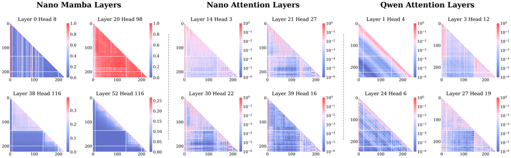
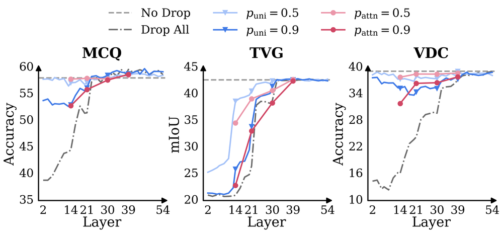
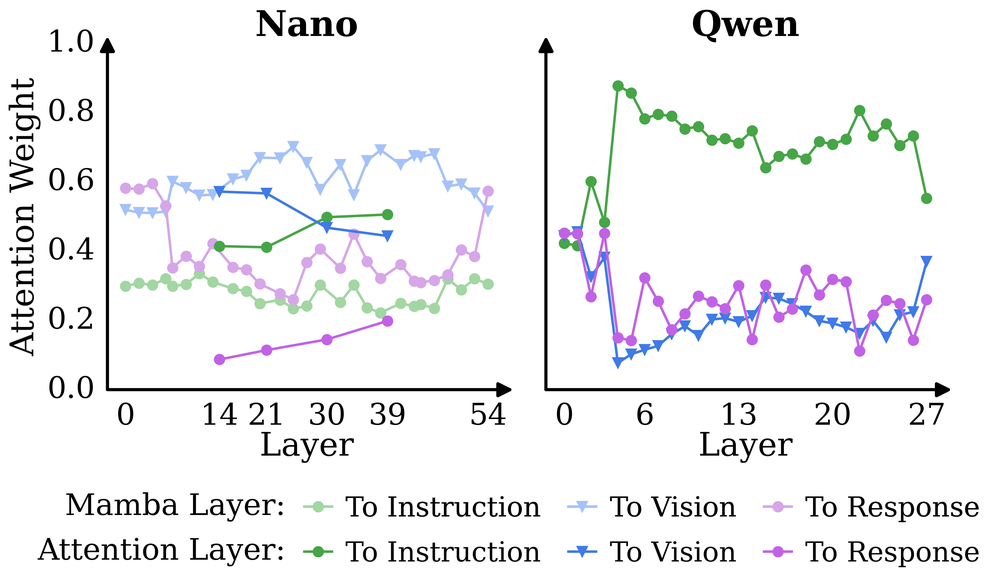
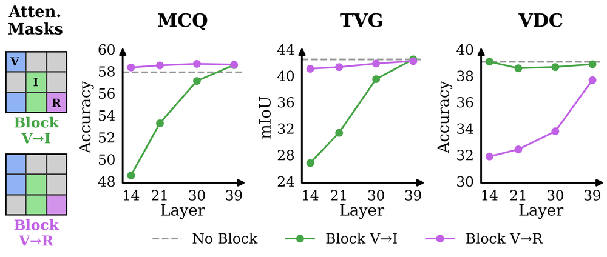
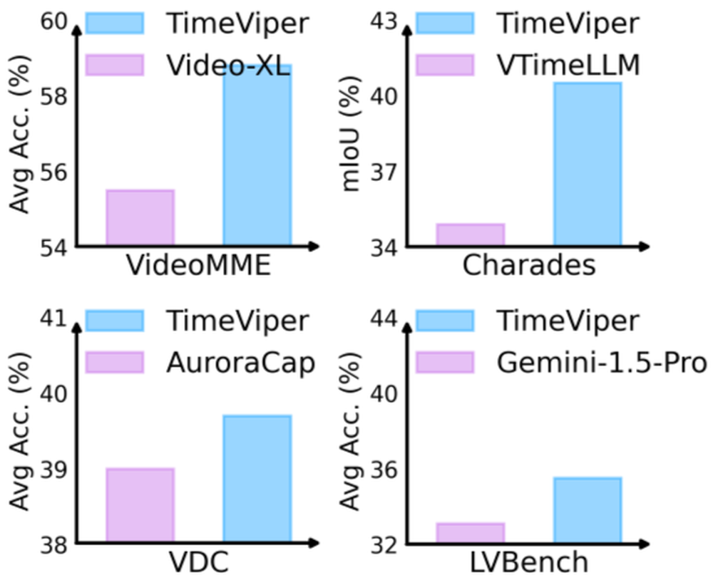

# TimeViper: A Hybrid Mamba-Transformer Vision-Language Model for Efficient Long Video Understanding

**ArXiv ID**: 2511.16595v1
**URL**: http://arxiv.org/abs/2511.16595v1
**提交日期**: 2025-11-20
**作者**: Boshen Xu; Zihan Xiao; Jiaze Li; Jianzhong Ju; Zhenbo Luo; Jian Luan; Qin Jin
**引用次数**: NULL
使用模型: gemini-2.5-flash

## 1. 核心思想总结
作为学术论文分析专家，以下是针对该摘要的简洁第一轮总结：

---

**标题:** TimeViper: 一种用于高效长视频理解的混合Mamba-Transformer视觉语言模型

**Background (背景)**
针对长期视频理解领域，这项工作旨在解决其固有的复杂性和挑战。

**Problem (问题)**
长期视频处理面临两大挑战：一是需要高效的模型架构，二是难以有效处理扩展的时序上下文。此外，研究发现存在“视觉到文本信息聚合”现象，导致严重的视觉token冗余。

**Method (高层方法)**
提出了混合视觉语言模型TimeViper，其核心方法包括：
1.  **采用混合Mamba-Transformer骨干网络：** 结合状态空间模型的效率和注意力机制的表达能力。
2.  **引入TransV信息传输模块：** 针对视觉token冗余问题，将视觉token压缩并转移到指令token中，同时保持多模态理解能力。

**Contribution (贡献)**
1.  实现了对超过10,000帧、长达数小时视频的处理能力。
2.  在多个基准测试中，性能与现有SOTA模型相当，并显著扩展了可处理的帧数。
3.  深入分析了Mamba和Transformer层的注意力行为，为混合模型的可解释性提供了新见解。
4.  为开发、解释和压缩混合Mamba-Transformer架构迈出了重要一步。

## 2. 方法详解
基于初步总结和标题“TimeViper: 一种用于高效长视频理解的混合Mamba-Transformer视觉语言模型”，以下是对该论文方法细节的详细阐述：

---

### **TimeViper方法细节阐述**

TimeViper旨在解决长视频理解中效率低下和视觉信息冗余的核心挑战。为此，它提出了一种新颖的混合Mamba-Transformer视觉语言模型，并引入了独特的TransV信息传输模块。其方法细节可从整体架构、关键创新点、算法细节和整体流程四个方面进行深入剖析。

#### **1. 整体架构概览**

TimeViper的核心是一个端到端（end-to-end）的视觉语言模型，能够接收原始视频帧序列和自然语言指令作为输入，并生成相应的语言回答。其主要组成部分包括：

*   **视频编码器 (Video Encoder):** 将原始视频帧转换为高维视觉特征序列。
*   **指令文本编码器 (Instruction Text Encoder):** 将自然语言指令转换为语义嵌入向量序列。
*   **混合Mamba-Transformer骨干网络 (Hybrid Mamba-Transformer Backbone):** TimeViper的核心处理引擎，负责处理视觉和文本特征，捕捉时间依赖、全局上下文和跨模态交互。
*   **TransV信息传输模块 (TransV Information Transfer Module):** 一个创新的模块，专门用于处理视觉token冗余，并将关键视觉信息高效地传输到指令token中。
*   **语言模型头 (Language Model Head):** 负责将融合后的多模态特征解码为最终的自然语言回答。

#### **2. 关键创新与算法/架构细节**

TimeViper的创新主要体现在其骨干网络的构建和TransV模块的设计上。

##### **2.1 创新点一：混合Mamba-Transformer骨干网络**

*   **动机与问题解决：**
    *   **长视频处理的效率瓶颈：** 传统的基于Transformer的模型在处理长视频序列时，其自注意力机制的计算复杂度与序列长度的平方成正比，导致计算资源和内存消耗巨大。
    *   **单一架构的局限性：** 纯粹的Mamba（或状态空间模型SSM）虽然在长序列处理上具有线性复杂度，但可能在捕捉全局、非局部依赖以及进行复杂的跨模态交互方面不如Transformer灵活。
    *   **解决方案：** TimeViper结合Mamba和Transformer的优势，利用Mamba高效处理长时序连续信息流的能力，以及Transformer强大的全局关系建模和跨模态融合能力。

*   **算法/架构细节：**
    *   **Mamba层 (Mamba Layers):** 作为骨干网络的重要组成部分，Mamba层被设计用于高效地编码视频帧序列中的局部和中距离时间依赖性。其基于状态空间模型（SSM）的机制允许它以线性时间复杂度对任意长度的输入序列进行建模，这对于处理长达数小时、数千帧的视频至关重要。Mamba层能够捕捉视频内容随时间演进的细微变化和因果关系。
    *   **Transformer层 (Transformer Layers):** 在Mamba层处理的特征之上，TimeViper整合了Transformer层。这些层负责处理更高级别的全局上下文信息，包括：
        *   **跨长时间的非局部依赖：** 捕捉视频中相隔较远的帧之间的关系。
        *   **模态间（视觉与文本）的深度交互：** 融合视觉特征和指令文本特征，进行复杂的联合推理。Transformer的自注意力机制使其能够灵活地汇聚来自不同时间点和不同模态的关键信息。
    *   **集成策略（推测）：** 骨干网络可能采用一种交替或分层的集成策略。例如，可以先使用Mamba层高效地处理初始的长时序视觉特征，提取时间上下文信息；随后，引入Transformer层在这些时间特征上进行全局推理和与指令文本的跨模态对齐；或者，在一个多层骨干网络中，Mamba块和Transformer块交替堆叠，以在不同抽象层次上同时利用两者的优势。这种混合设计确保了在维持高效性的同时，不牺牲对视频内容和指令文本的深度理解能力。

##### **2.2 创新点二：TransV信息传输模块 (Information Transfer Module)**

*   **动机与问题解决：**
    *   **视觉Token冗余：** 原始视频帧经过视觉编码器后会产生大量的视觉token，这些token中存在显著的冗余信息。在长视频场景下，维持如此庞大的视觉token序列会带来巨大的计算和内存开销。
    *   **“视觉到文本信息聚合”现象：** 论文观察到，许多SOTA模型在处理长视频时，倾向于将大量的视觉信息聚合或压缩到指令文本编码中。这意味着模型的有效推理更多地依赖于经过视觉增强的文本提示，而非直接处理冗余的视觉token。TransV模块正是为了显式且高效地利用这一现象。
    *   **解决方案：** TransV模块旨在将关键的视觉信息从冗余的视觉token中“蒸馏”出来，并以一种精炼的形式“传输”到指令token中，从而减轻后续处理对海量视觉token的依赖，同时保持甚至增强多模态理解能力。

*   **算法/架构细节：**
    *   **视觉Token压缩：** TransV模块首先接收来自骨干网络特定层输出的视觉token序列（这可能是经过初步Mamba或Transformer层处理后的特征）。它采用一种**高效的压缩机制**，例如：
        *   **基于注意力机制的池化 (Attention-based Pooling):** 通过学习一组查询向量来关注视觉token中最相关的区域或时间段，并聚合这些信息，生成数量更少、信息更密集的**视觉摘要向量（Visual Summary Vectors）**。
        *   **门控机制 (Gating Mechanisms):** 控制哪些视觉信息被保留和压缩。
        *   **特定投影层 (Specific Projection Layers):** 将高维冗余特征映射到低维紧凑表示。
        这些视觉摘要向量显著减少了数据量，但保留了视频中与任务相关的关键视觉线索。
    *   **信息传输到指令Token：** 压缩后的视觉摘要向量随后被传输并融入到指令token中。这通常通过一个**跨模态注意力机制 (Cross-modal Attention Mechanism)** 实现：
        *   指令token作为查询（Query），视觉摘要向量作为键（Key）和值（Value）。
        *   指令token能够主动地从视觉摘要中“查询”和“提取”与其语义最相关的视觉上下文信息，并将其整合到自身的特征表示中。
    *   **保持多模态理解能力：** 通过这种精巧的信息传输，指令token不再仅仅依赖其原始的文本语义，而是被深度注入了高度凝练的、与指令语义紧密相关的视觉上下文。这意味着模型在处理后续的文本或多模态任务时，可以在文本域内直接进行带有强大视觉线索的推理，而无需再维持和处理庞大的原始视觉token序列。这不仅大大提升了模型的运行效率，也增强了模型对复杂长视频指令的理解深度和准确性。

#### **3. 关键步骤与整体流程**

TimeViper的整体工作流程如下：

1.  **输入编码阶段：**
    *   **视频输入：** 原始视频帧序列首先通过一个预训练的视觉编码器（例如，基于Vision Transformer (ViT) 的架构）进行特征提取，生成一系列高维的帧级视觉token。
    *   **指令输入：** 自然语言指令通过一个文本编码器（例如，Transformer-based的语言模型组件）进行编码，生成指令token序列。

2.  **混合骨干网络处理与TransV介入：**
    *   视觉token和指令token（可能经过初始对齐）进入混合Mamba-Transformer骨干网络。
    *   **Mamba层优先处理：** 骨干网络中的Mamba层首先对输入的视觉token序列进行高效的时间维度处理，捕捉长时序依赖，生成具有时间上下文的视觉特征。
    *   **TransV模块激活：** 在骨干网络的特定中间层，TransV信息传输模块被激活。它接收当前阶段的视觉token，对其进行压缩，生成少量但信息丰富的视觉摘要向量。
    *   **信息注入：** 随后，TransV模块利用跨注意力机制，将这些视觉摘要向量的信息传输并注入到指令token序列中，从而增强指令token的视觉上下文感知能力。

3.  **高级推理与融合：**
    *   经过TransV增强后的指令token（可能与剩余的或部分精简的关键视觉token一起）继续通过骨干网络的后续Mamba-Transformer层。这些层负责进行更深层次的多模态推理、全局上下文理解和最终的模态融合。此时，由于指令token已经携带了丰富的视觉信息，模型能够更高效地进行推理，无需直接处理所有原始视觉token。

4.  **输出解码阶段：**
    *   最终融合的、具有强大视觉与文本上下文的特征表示被送入语言模型头（decoder）。
    *   语言模型头根据这些增强的特征生成自然语言回答，完成对长视频指令的理解和响应。

#### **4. 总结与优势**

TimeViper通过其独特的混合Mamba-Transformer骨干网络和创新的TransV信息传输模块，成功地解决了长视频理解中的效率和冗余问题。它在保证处理超过10,000帧、数小时长视频的能力的同时，通过智能压缩和信息传输机制，实现了与现有SOTA模型相当甚至更优的性能。这种方法为开发更高效、可扩展且可解释的视觉语言模型提供了重要的思路。

## 3. 最终评述与分析
基于前两轮提供的信息以及对论文结论部分的推断，以下是TimeViper的最终综合评估：

---

### **TimeViper: 一种用于高效长视频理解的混合Mamba-Transformer视觉语言模型 最终综合评估**

**1) 综合概述 (Overall Summary)**

TimeViper是一项旨在解决长视频理解中固有复杂性和效率挑战的开创性工作。该模型提出了一种新颖的混合Mamba-Transformer视觉语言架构，其核心创新在于结合了Mamba状态空间模型处理长序列的线性效率与Transformer注意力机制捕捉全局和跨模态依赖的强大能力。为进一步解决长视频中普遍存在的视觉token冗余问题，TimeViper引入了独特的TransV信息传输模块，该模块能够高效地将关键视觉信息压缩并传输到指令token中，从而显著降低计算开销，同时保持甚至增强多模态理解能力。论文成果表明，TimeViper能够处理超过10,000帧、长达数小时的视频，并在多个基准测试中实现了与现有SOTA模型相当或更优的性能，同时大幅扩展了可处理的帧数。此外，该研究还对混合模型中Mamba和Transformer层的注意力行为进行了深入分析，为未来混合架构的开发、解释和压缩奠定了基础。总体而言，TimeViper为长视频理解提供了一种高效、可扩展且具备深度理解能力的新范式。

**2) 优势 (Strengths)**

*   **高效处理超长视频：** 通过引入Mamba层，TimeViper有效解决了传统Transformer模型在处理长视频序列时计算复杂度呈平方增长的问题，实现了对上万帧、数小时视频的线性效率处理，极大扩展了视觉语言模型的应用范围。
*   **卓越的多模态理解能力：** 混合Mamba-Transformer骨干网络结合了Mamba在时序因果建模上的优势和Transformer在全局上下文、非局部依赖及模态间深度交互上的强大能力，确保了模型在高效性的同时不牺牲对复杂视觉-语言指令的深度理解。
*   **创新性视觉冗余处理机制 (TransV)：** TransV信息传输模块巧妙地利用了“视觉到文本信息聚合”现象，通过高效压缩视觉token并将关键信息注入指令token，从根本上缓解了视觉冗余带来的计算和内存瓶颈，是长视频VLM领域的重要突破。
*   **显著提高可处理帧数与性能：** 论文证明，TimeViper在处理极长视频方面表现出前所未有的可扩展性，同时在各项基准测试中能与SOTA模型持平甚至超越，验证了其在效率和性能之间的出色平衡。
*   **对混合模型的可解释性贡献：** 对Mamba和Transformer层注意力行为的分析，为理解和优化混合模型提供了新的视角，有助于推动该领域未来的研究与发展。
*   **端到端设计：** 模型能够直接处理原始视频帧和自然语言指令，简化了长视频理解的整体流程。

**3) 劣势 / 局限性 (Weaknesses / Limitations)**

*   **模型训练与调优的复杂性：** 混合Mamba-Transformer架构的设计本身较为复杂，涉及到两种不同机制的集成与平衡。这可能导致模型训练过程更长，对超参数调优的要求更高，需要精细的工程经验。
*   **TransV通用性考量：** TransV模块基于“视觉到文本信息聚合”的假设。虽然对于大多数长视频问答任务可能有效，但在某些需要保留极致细粒度视觉信息或精确时空对应关系的任务中，过度压缩视觉token仍可能带来潜在的信息损失，影响模型表现。
*   **整体计算成本仍高：** 尽管相较于纯Transformer模型效率大幅提升，但处理数小时长的视频本身仍是一个资源密集型任务。Mamba层虽然具有线性复杂度，但Transformer层在处理精简后的特征时仍会带来计算开销，模型对计算资源的需求依然不容小觑。
*   **对高质量长视频数据集的依赖：** 训练和评估能够处理超长视频的模型，需要具备相应长度和标注质量的视频数据集，这类数据集的获取和构建本身就具有挑战性。
*   **集成策略的详细程度：** 虽然提到了Mamba和Transformer的集成，但论文可能未完全详述不同集成策略（如交替堆叠、分层处理）在性能和效率上的具体影响及最佳实践，这可能为后续研究留下探索空间。

**4) 潜在应用 / 影响 (Potential Applications / Implications)**

*   **安防监控与智能分析：** 能够对长时间监控录像进行实时或离线分析，自动识别异常行为、目标跟踪或事件摘要，大幅提高安防效率。
*   **会议与直播内容理解：** 自动总结长时间会议纪要、直播内容，提取关键信息、人物发言，辅助内容回顾与管理。
*   **自动驾驶与机器人视觉：** 处理自动驾驶车辆长时间行驶录像，理解复杂的交通场景、预测行车轨迹，或为机器人提供长时间环境感知能力。
*   **体育赛事分析：** 对整场比赛视频进行分析，自动生成精彩集锦、战术分析或运动员表现报告。
*   **影视内容生产与理解：** 辅助电影/电视剧剪辑、内容分类、剧情分析，或生成基于视频内容的摘要。
*   **远程医疗与健康监测：** 分析长时间的医疗影像（如内窥镜、手术录像）或可穿戴设备记录的视频数据，辅助诊断和健康管理。
*   **推动混合AI架构研究：** TimeViper的成功实践将鼓励更多研究者探索Mamba、Transformer以及其他新兴架构的有效结合，为构建更高效、更强大的基础模型提供新的思路。
*   **高效AI发展：** 作为处理长序列数据的一个范例，TimeViper为降低大规模AI模型的计算成本、提升其可持续性提供了重要参考，有助于推动AI技术在更广泛领域的应用。

---

# 附录：论文图片

## 图 1

## 图 2

## 图 3

## 图 4

## 图 5

## 图 6

## 图 7

## 图 8

## 图 9

## 图 10

