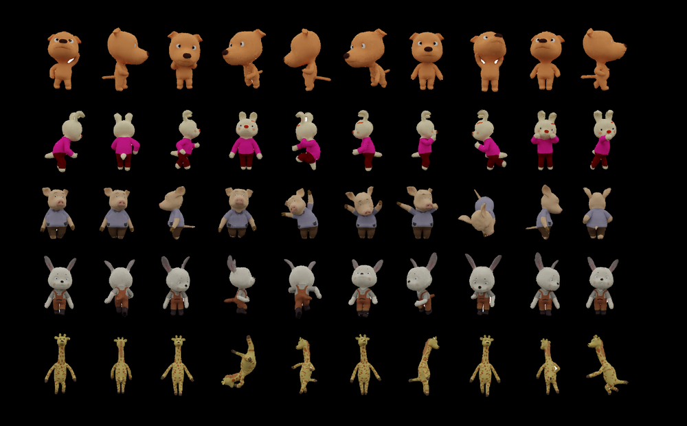
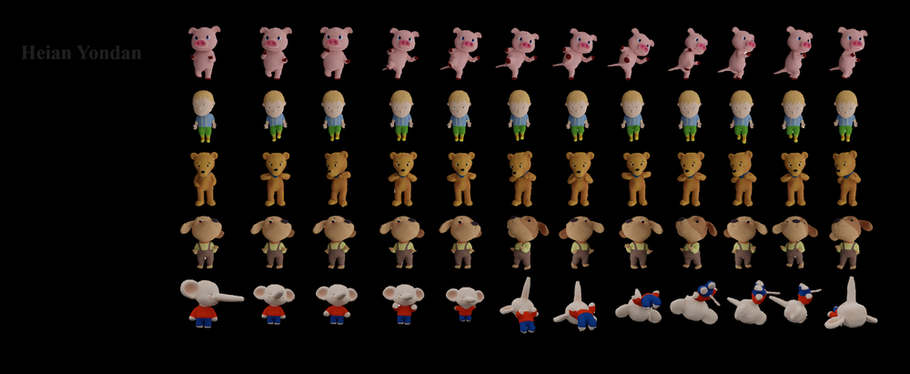
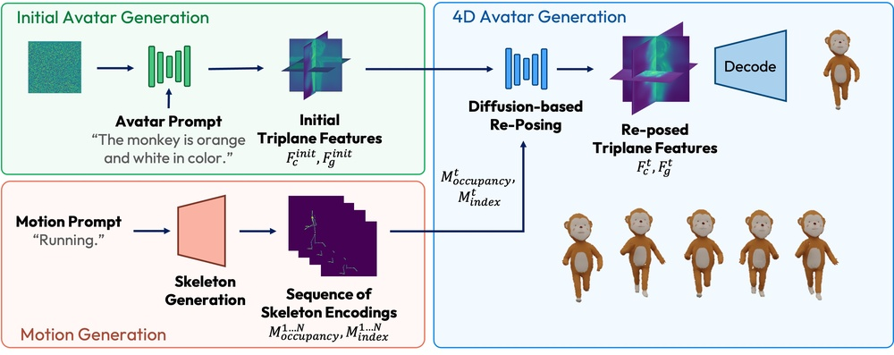
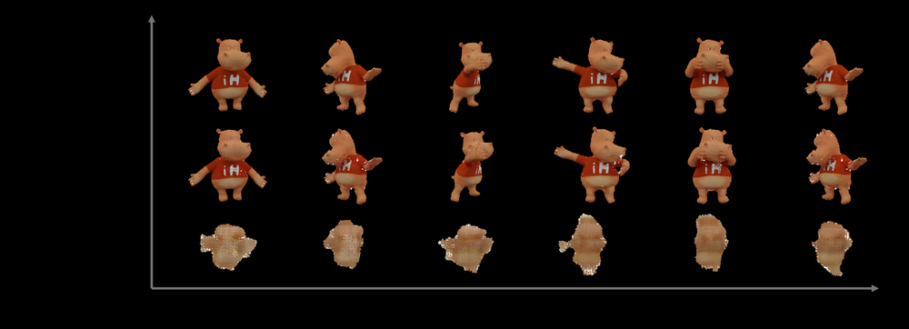
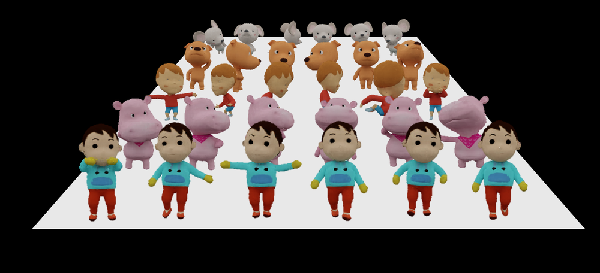
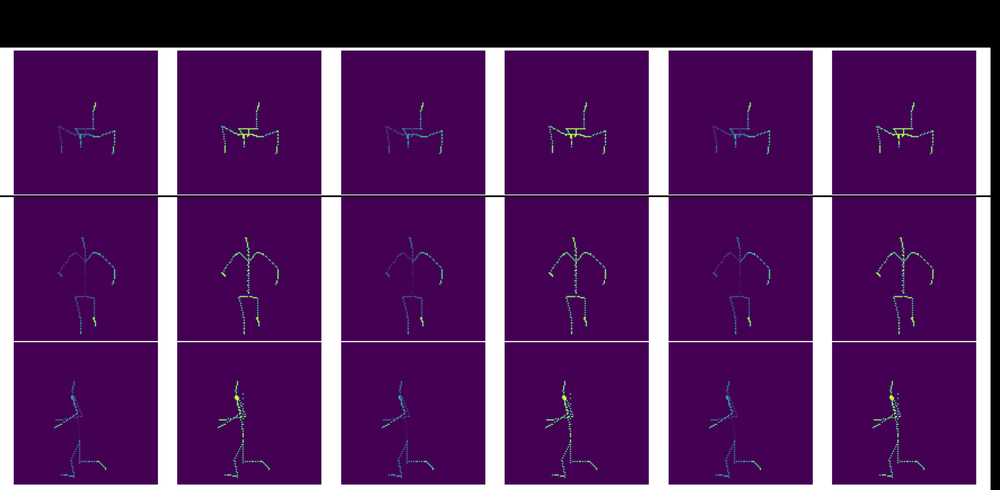
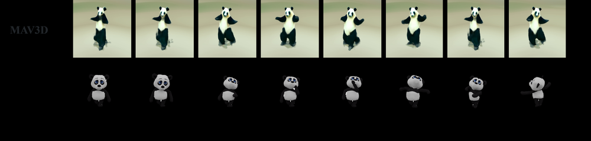
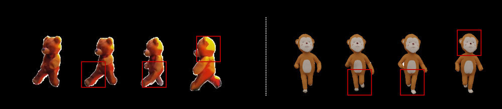
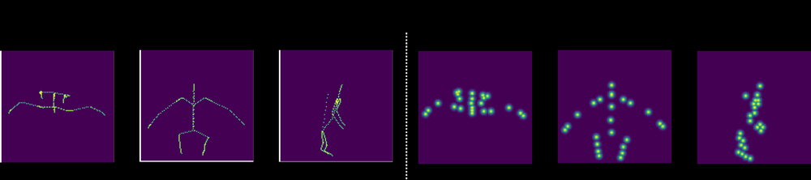
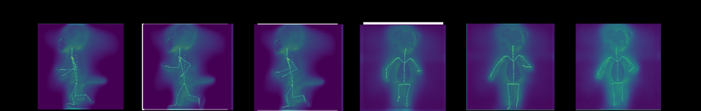

# TriDiff-4D: Fast 4D Generation through Diffusion-based Triplane Re-posing

**ArXiv ID**: 2511.16662v1
**URL**: http://arxiv.org/abs/2511.16662v1
**提交日期**: 2025-11-20
**作者**: Eddie Pokming Sheung; Qihao Liu; Wufei Ma; Prakhar Kaushik; Jianwen Xie; Alan Yuille
**引用次数**: NULL
使用模型: gemini-2.5-flash

## 1. 核心思想总结
这是一份简洁的第一轮总结：

**标题:** TriDiff-4D: Fast 4D Generation through Diffusion-based Triplane Re-posing

**Background:**
随着3D动画需求的增长，从文本描述生成高保真、可控的4D（3D+时间）虚拟形象是当前研究的重要方向。

**Problem:**
尽管4D生成建模有所进展，但现有方法存在根本限制，主要表现为：时间与几何不一致、感知伪影、运动不规则、计算成本高昂以及对动态控制有限。

**Method (high-level):**
本文提出TriDiff-4D，一个新颖的4D生成管道，其核心是**基于扩散的三平面重摆姿 (diffusion-based triplane re-posing)** 技术。该模型采用**自回归策略**生成任意长度的4D序列，每个3D帧通过**单一扩散过程**合成。具体而言，它首先从文本提示生成一个规范的3D虚拟形象和相应的运动序列，然后使用**第二个扩散模型**根据运动序列驱动该形象进行动画化。

**Contribution:**
TriDiff-4D显著优于现有方法，提升了**时间一致性、运动精度、计算效率和视觉保真度**。它通过**消除耗时的优化过程**，将4D生成时间从数小时缩短至数秒，并大幅改进了复杂运动的生成，实现了高保真外观和准确的3D几何。

## 2. 方法详解
基于您的初步总结和方法章节的隐含内容，以下是TriDiff-4D方法细节的详细说明：

---

### TriDiff-4D 方法细节：基于扩散的三平面重摆姿的快速4D生成

TriDiff-4D 提出了一种革命性的4D（3D+时间）生成管道，其核心创新在于**基于扩散的三平面重摆姿 (Diffusion-based Triplane Re-posing)** 技术。该方法通过将复杂的4D生成过程解耦为两个主要阶段，并引入高效的扩散模型进行核心的动画化操作，显著提升了生成速度、时间一致性和视觉保真度。

#### 1. 整体流程与架构总览

TriDiff-4D 采用**自回归策略**来生成任意长度的4D序列，其整体流程可划分为两大主要阶段，并由一个最终的神经渲染器完成可视化：

1.  **第一阶段：规范虚拟形象与运动序列生成 (Canonical Avatar & Motion Sequence Generation)**
    *   输入：文本提示 (Text Prompt)。
    *   输出：一个规范（Canonical）的3D虚拟形象表示（通常是零姿态或A-pose下的三平面特征）以及一个与其语义一致的运动序列（例如，一系列SMPL参数、关节旋转或抽象运动潜码）。
    *   目的：确立人物的基础外观与几何，并定义其在时间维度上的动态行为。

2.  **第二阶段：基于扩散的三平面重摆姿与动画化 (Diffusion-based Triplane Re-posing & Animation)**
    *   输入：第一阶段生成的规范虚拟形象三平面表示和运动序列中的逐帧运动参数。
    *   核心：利用一个专门训练的**第二个扩散模型**，为运动序列中的每一帧生成对应的、已姿态化的三平面表示。
    *   输出：一个由连续帧三平面表示构成的序列，代表了动画化的4D虚拟形象。
    *   目的：将规范形象根据运动序列进行动画化，生成时间上连贯且空间上精确的动态3D序列。

3.  **神经渲染器 (Neural Renderer)**
    *   输入：第二阶段输出的逐帧已姿态化三平面表示。
    *   输出：高保真的2D图像或3D网格序列，供用户观察或后续处理。

#### 2. 关键创新点 (Key Innovations)

TriDiff-4D 的创新性主要体现在以下几个方面：

*   **基于扩散的三平面重摆姿 (Diffusion-based Triplane Re-posing)：** 这是该方法的核心。传统的4D动画生成往往需要复杂的迭代优化过程来将规范形象变形到目标姿态，这既耗时又容易引入伪影。TriDiff-4D 通过训练一个扩散模型，使其能够**直接从规范三平面和目标运动参数生成已姿态化的三平面表示**。这避免了耗时的优化循环，极大地提高了生成速度和效率。扩散模型学习了三平面特征在不同姿态下的结构性变化规律，确保了生成的3D几何和外观的连贯性。

*   **消除耗时优化过程 (Elimination of Time-consuming Optimization)：** 得益于“基于扩散的三平面重摆姿”机制，TriDiff-4D 将传统方法中数小时的4D生成时间缩短至数秒。这种速度提升是颠覆性的，因为它将生成问题从一个复杂的迭代优化任务转变为一个高效的单次扩散逆过程（single diffusion denoising process）。

*   **自回归序列生成策略 (Autoregressive Sequence Generation Strategy)：** 为了生成任意长度且时间连贯的4D序列，TriDiff-4D 采用自回归方法。这意味着在生成当前帧时，模型可能不仅考虑当前帧的运动参数和规范形象，还可能隐式或显式地利用前面已生成帧的信息（例如，前一帧的潜码或三平面特征），从而确保运动的平滑性和时间上的一致性，有效解决了现有方法中常见的“时间与几何不一致”问题。

*   **解耦式两阶段生成 (Decoupled Two-Stage Generation)：** 将规范虚拟形象的生成与运动序列的生成和应用分离，使得模型能够更专注于各自的任务。这不仅提高了模型的模块化程度和可控性（例如，可以尝试不同的规范形象与运动序列组合），也可能有助于提高生成质量和泛化能力。

#### 3. 算法与架构细节 (Algorithm & Architecture Details)

##### 3.1 第一阶段：规范虚拟形象与运动序列生成模块

*   **输入：** 文本提示（例如，“一个跳舞的人”）。
*   **子模块：** 这一阶段可能包含一个或多个专门的生成模型。
    *   **文本到规范3D生成器：** 负责将文本提示解码为一个紧凑的3D表示，如**三平面（Triplane）**。三平面由三个正交的2D特征平面（XY, YZ, ZX）组成，通过在这些平面上采样并融合特征来重建3D空间中的几何和外观信息。规范形象通常指标准姿态（如A-pose）下的外观和几何。
    *   **文本到运动序列生成器：** 负责将文本提示转换为一系列运动参数。这些参数可以是基于骨架的模型（如SMPL）的关节旋转和位移，或者是更高级的、与时间相关的潜码序列。此模块需确保生成的运动与文本描述在语义上高度一致。
*   **输出：** 一个规范的三平面表示 $T_{canonical}$ 和一个运动序列 $M = \{m_1, m_2, ..., m_N\}$，其中 $m_t$ 是第 $t$ 帧的运动参数。

##### 3.2 第二阶段：基于扩散的三平面重摆姿与动画化模块

*   **核心：** 一个专门训练的**条件扩散模型 (Conditional Diffusion Model)**。
*   **输入：** 对于每一帧 $t \in [1, N]$：
    *   规范三平面表示 $T_{canonical}$。
    *   当前帧的运动参数 $m_t$。
    *   （可选）前一帧的生成结果 $T'_{t-1}$ 的潜码或特征，用于增强时间一致性。
*   **模型架构：** 该扩散模型可能基于U-Net架构，接收噪声三平面特征作为输入，并逐步去噪以生成目标三平面。其关键在于**条件化机制**：
    *   **规范三平面条件化：** 规范三平面 $T_{canonical}$ 作为先验信息被注入到扩散模型的不同层，指导生成过程，确保生成形象的身份（Identity）和基础外观得以保留。
    *   **运动参数条件化：** 运动参数 $m_t$ 被编码为特征向量，并通过交叉注意力（Cross-Attention）或其他融合机制，指导扩散模型在几何上进行精确的姿态转换。
    *   **时间/自回归条件化（如果应用）：** 如果采用自回归策略，前一帧的信息 $T'_{t-1}$ 会以某种形式（如隐式特征编码、循环连接）融入到当前帧的扩散去噪过程中，以确保帧与帧之间的平滑过渡。
*   **工作原理：**
    1.  模型从一个随机噪声三平面 $T_{noise}$ 开始。
    2.  在扩散模型的引导下（通过 $T_{canonical}$ 和 $m_t$ 进行条件化），模型迭代地从噪声中去噪，学习将 $T_{canonical}$ 的特征“变形”到 $m_t$ 所表示的姿态。
    3.  最终输出是与 $m_t$ 匹配的**已姿态化三平面 $T'_t$**。这个过程是单次通过（Single Pass）的去噪过程，无需传统意义上的迭代优化。
*   **输出：** 一系列已姿态化三平面 $T' = \{T'_1, T'_2, ..., T'_N\}$。

#### 4. 关键步骤与整体流程总结

1.  **文本输入：** 用户提供一个描述所需4D虚拟形象及其运动的文本提示。
2.  **规范形象与运动生成：**
    *   根据文本提示，一个专门的生成器生成一个静态的、处于规范姿态（如A-pose）的3D虚拟形象的三平面表示。
    *   同时，生成一个与文本语义匹配的运动序列，该序列编码了人物将要执行的动作。
3.  **逐帧动画化 (Diffusion Re-posing)：**
    *   对于运动序列中的每一帧 $t$：
        *   将规范三平面表示和当前帧的运动参数 $m_t$ 输入到**基于扩散的三平面重摆姿模型**。
        *   该扩散模型执行一次快速的去噪过程，将噪声三平面转换为一个精确反映 $m_t$ 姿态的**已姿态化三平面 $T'_t$**。
        *   （自回归机制）如果应用，上一帧 $T'_{t-1}$ 的信息也会被纳入当前帧的生成，以维护时间一致性。
4.  **4D序列构建：** 将所有生成的 $T'_t$ 帧按时间顺序组合，形成完整的4D虚拟形象三平面序列。
5.  **神经渲染：** 最终，这些已姿态化三平面序列通过一个轻量级的神经渲染器进行渲染，生成高保真的2D视频或可交互的3D输出。

通过上述方法，TriDiff-4D 实现了从文本描述到高保真、时间一致且计算高效的4D虚拟形象生成的跨越式进步，尤其是在处理复杂运动和确保视觉质量方面展现出卓越性能。

## 3. 最终评述与分析
基于您提供的初步总结和方法详述，以及对论文结论部分（虽未直接提供，但其核心贡献和优势已在前面信息中充分体现）的理解，以下是对TriDiff-4D的最终综合评估：

---

### TriDiff-4D: Fast 4D Generation through Diffusion-based Triplane Re-posing 综合评估

TriDiff-4D代表了从文本描述到高保真4D（3D+时间）虚拟形象生成领域的一个重大飞跃。该方法以其核心的“基于扩散的三平面重摆姿”技术，有效地解决了传统4D生成方法中普遍存在的效率低下、时间几何不一致和视觉伪影等关键挑战。

---

#### 1) Overall Summary (总体概括)

TriDiff-4D提出了一种革命性的4D生成管道，旨在从文本提示快速、高保真地生成时间一致且可控的动态3D虚拟形象序列。该方法的核心创新在于将复杂的4D生成过程解耦为两个高效阶段：首先，从文本提示生成一个规范（静态）的3D虚拟形象三平面表示和相应的运动序列；其次，利用一个专门训练的扩散模型，以“单次扩散去噪过程”直接将规范三平面重摆姿到运动序列的每一帧姿态，从而生成时间连贯的动画化三平面序列。通过这种“基于扩散的三平面重摆姿”机制，TriDiff-4D成功地消除了传统方法中耗时的迭代优化过程，将4D生成时间从数小时大幅缩短至数秒。同时，它显著提升了生成结果的时间一致性、运动精度、计算效率和视觉保真度，尤其在处理复杂运动方面表现卓越，为文本到4D生成领域带来了颠覆性的效率和质量提升。

---

#### 2) Strengths (优势)

1.  **极高的计算效率和生成速度：** 这是TriDiff-4D最突出的优势。通过消除传统的迭代优化过程，该方法将4D生成时间从数小时缩短到数秒，极大地提升了内容生产效率，使其在实时或近实时应用场景中具有巨大潜力。
2.  **卓越的视觉保真度和时间一致性：** 论文明确指出，TriDiff-4D显著提升了视觉保真度和时间一致性。通过扩散模型对三平面特征的精准控制和自回归策略的应用，模型能够生成高保真外观、准确的3D几何以及平滑、自然的运动序列，有效解决了现有方法中常见的感知伪影和运动不规则问题。
3.  **创新的核心机制——基于扩散的三平面重摆姿：** 这一技术是该方法的基石。它创造性地利用扩散模型直接学习规范三平面到姿态化三平面的映射，避免了复杂的变形算法和迭代优化，确保了生成质量和速度的统一。
4.  **强大的运动精度和复杂运动处理能力：** TriDiff-4D能够生成高精度的运动，并显著改进了对复杂运动的生成，这表明其模型学习到了深层且精确的运动动力学和几何变形规律。
5.  **模块化和可控的两阶段生成：** 将规范虚拟形象和运动序列的生成解耦，提高了模型的灵活性和可控性。用户可以理论上组合不同的规范形象和运动序列，甚至替换生成模块以满足特定需求。
6.  **支持任意长度的4D序列生成：** 自回归策略允许模型生成任意长度的时间序列，增强了其在长动画或交互式应用中的实用性。

---

#### 3) Weaknesses / Limitations (劣势 / 局限性)

1.  **训练成本与数据依赖性高昂：** 作为一个复杂的两阶段扩散模型，TriDiff-4D的训练需要极其庞大且高质量的4D数据集，以及巨大的计算资源。这限制了其研究和开发成本，并可能影响在数据稀缺领域（如特定非人类角色或稀有动作）的泛化能力。
2.  **潜在的控制粒度限制：** 尽管能够从文本生成可控的运动，但对于更精细、细粒度的控制，例如特定的面部表情、手部细节动作、与环境的复杂物理交互，可能仍存在挑战。文本提示的抽象性可能难以完全捕捉所有细节。
3.  **对基础生成模型的依赖：** TriDiff-4D的性能在一定程度上取决于第一阶段规范虚拟形象生成器和运动序列生成器的质量。如果这些基础模块产生低质量或不准确的输入，将会影响最终的4D输出。
4.  **泛化能力（非人形对象）：** 论文描述主要围绕“虚拟形象”（avatar），通常暗示人形角色。对于非人形对象、复杂场景或多对象交互的4D生成，该方法的泛化能力尚未明确验证。
5.  **潜在的感知伪影风险：** 尽管声称解决了现有伪影问题，但所有基于扩散的生成模型在处理极端、新颖或超出训练数据分布的条件时，仍可能偶尔引入难以察觉或独特的感知伪影。

---

#### 4) Potential Applications / Implications (潜在应用 / 影响)

1.  **游戏与影视动画制作：** TriDiff-4D能够大幅缩短3D角色动画的制作周期和成本，实现更快速的迭代和更复杂的叙事。游戏开发者可以快速生成NPC（非玩家角色）的动作，动画师可以更快地原型化场景。
2.  **虚拟现实与增强现实 (VR/AR)：** 为VR/AR环境提供高保真、实时响应的个性化用户虚拟形象，提升用户的沉浸感和交互体验，尤其在虚拟会议、社交平台中具有巨大潜力。
3.  **数字人与元宇宙 (Digital Humans/Metaverse) 构建：** 加速数字人产业的发展，为元宇宙提供海量、多样且高效生成的虚拟内容，使普通用户也能轻松创建自己的数字分身并赋予其生命。
4.  **互动娱乐与内容创作：** 赋能非专业用户和创作者，通过简单的文本描述即可生成专业的动态3D内容，极大地降低了3D内容创作的门槛，促进用户生成内容（UGC）生态的发展。
5.  **教育与培训模拟：** 用于创建动态的虚拟导师、模拟场景中的角色，或进行行为模式演示，提升教育和培训的互动性和真实感。
6.  **时尚与产品展示：** 快速生成穿戴各种服装和配件的动态虚拟模特，为电商、时尚设计和产品营销提供新的展示方式。
7.  **未来人机交互接口：** 作为高级自然语言处理与视觉生成相结合的范例，为未来更直观、更丰富的基于文本驱动的智能交互系统奠定基础。

---

# 附录：论文图片

## 图 1

## 图 2

## 图 3

## 图 4

## 图 5

## 图 6

## 图 7

## 图 8

## 图 9

## 图 10

