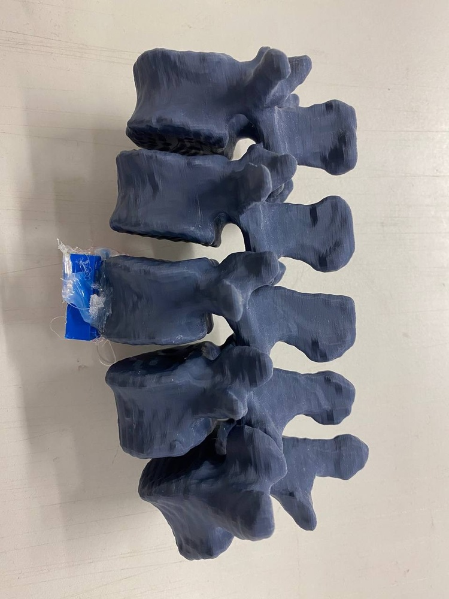
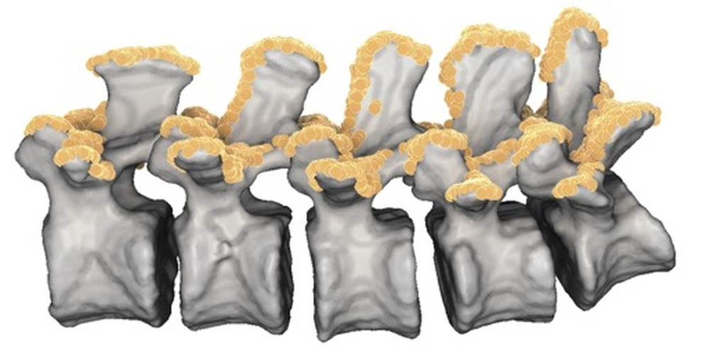
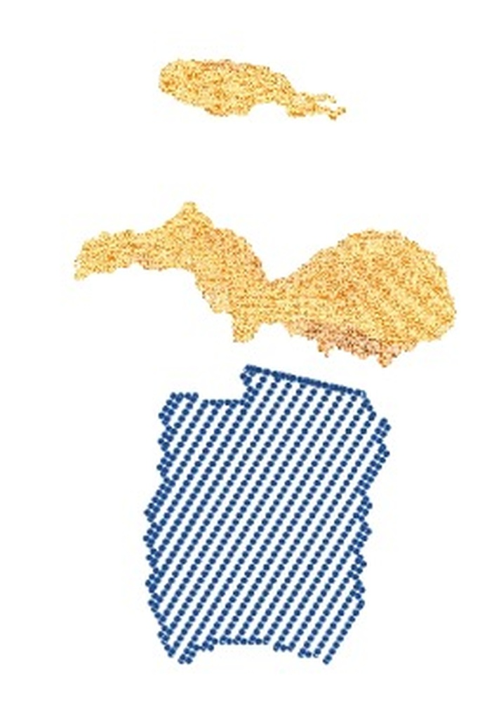
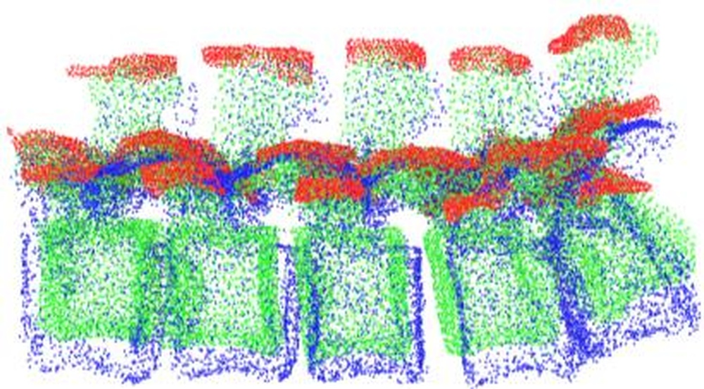
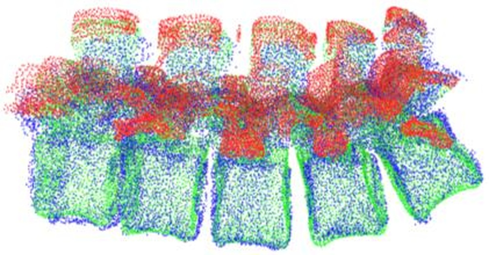
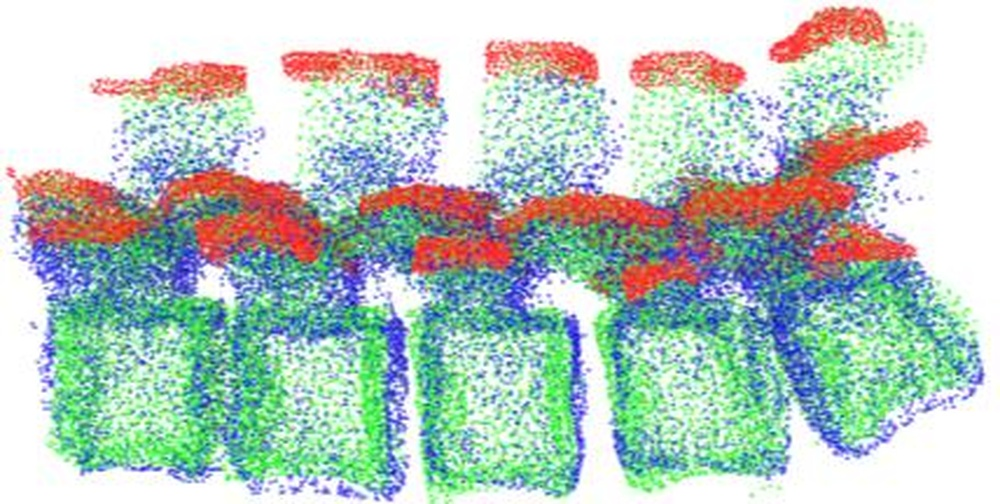

# US-X Complete: A Multi-Modal Approach to Anatomical 3D Shape Recovery

**ArXiv ID**: 2511.15600v1
**URL**: http://arxiv.org/abs/2511.15600v1
**提交日期**: 2025-11-19
**作者**: Miruna-Alexandra Gafencu; Yordanka Velikova; Nassir Navab; Mohammad Farid Azampour
**引用次数**: NULL
使用模型: Unknown

## 1. 核心思想总结
抱歉，没有可用的LLM客户端。请检查API密钥配置。

## 2. 方法详解
抱歉，没有可用的LLM客户端。请检查API密钥配置。

## 3. 最终评述与分析
抱歉，没有可用的LLM客户端。请检查API密钥配置。

---

# 附录：论文图片

## 图 1

## 图 2

## 图 3

## 图 4

## 图 5

## 图 6

## 图 7

## 图 8

## 图 9

## 图 10

