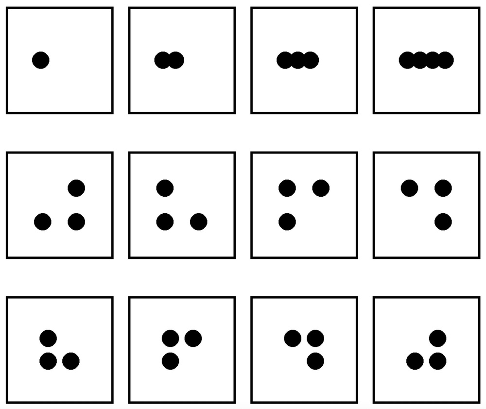
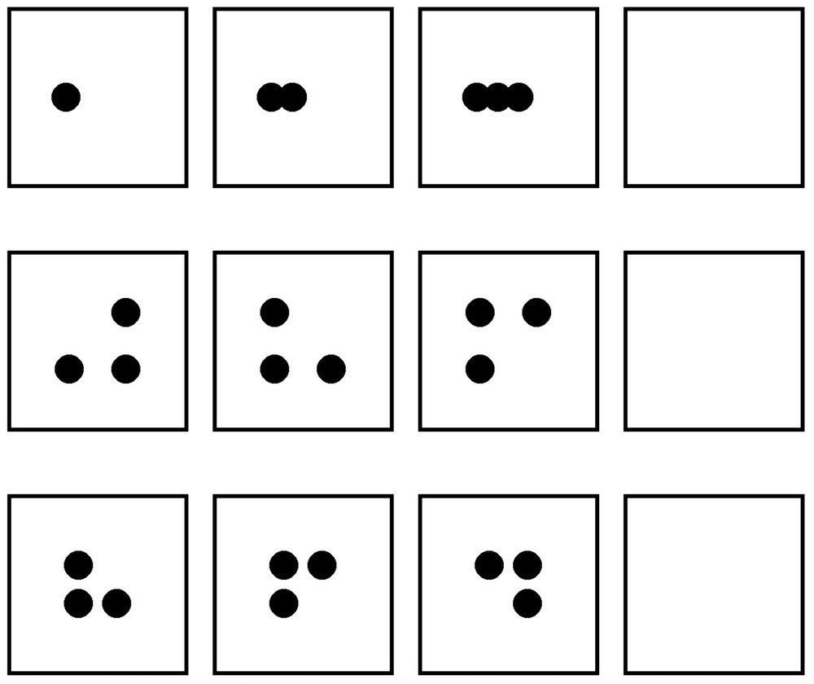
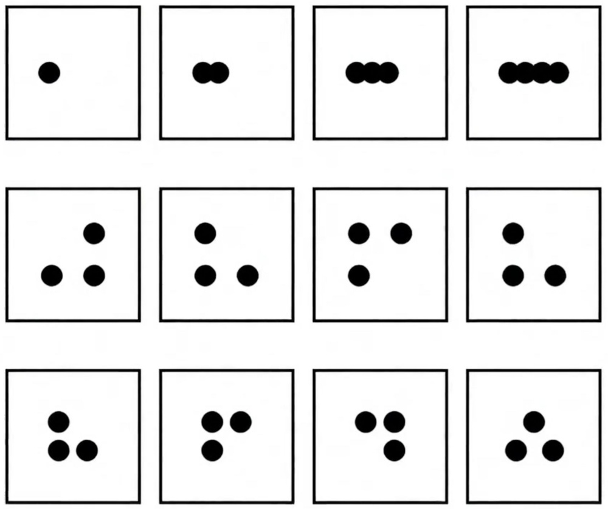
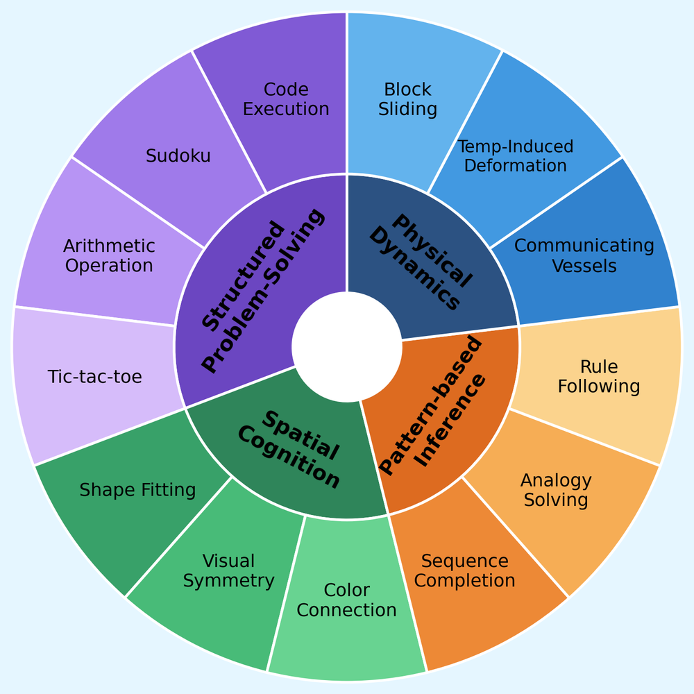
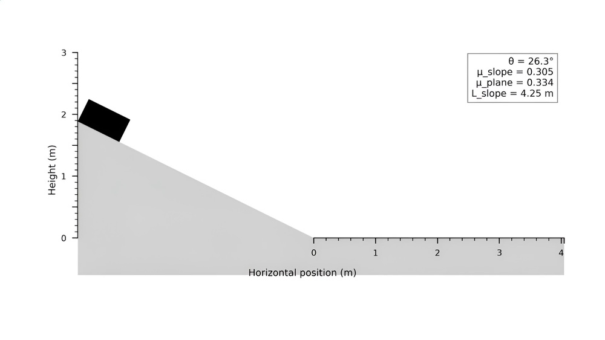
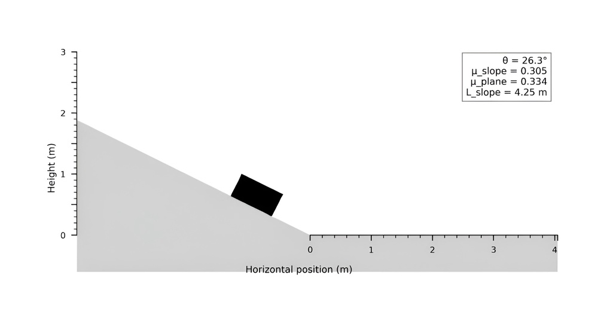
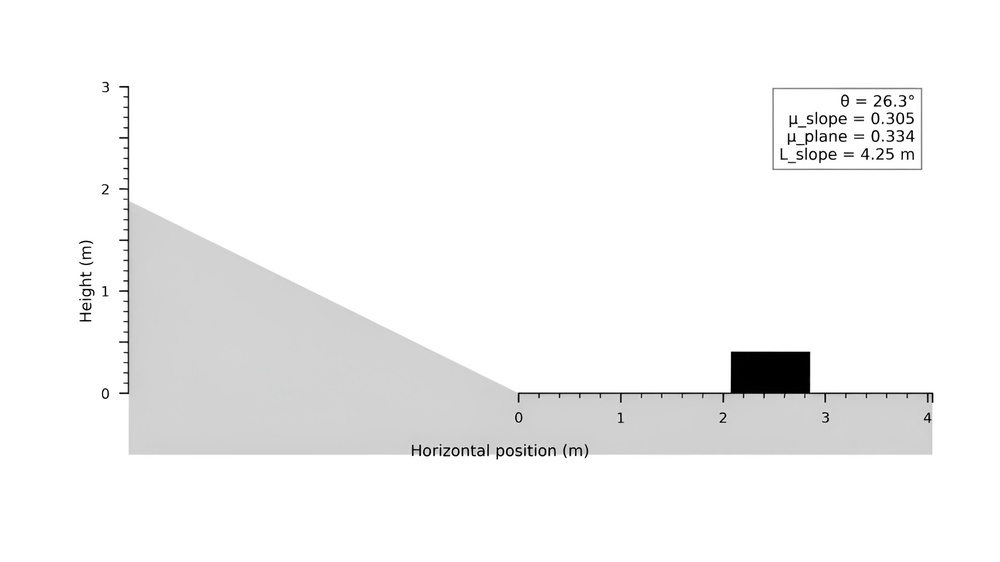
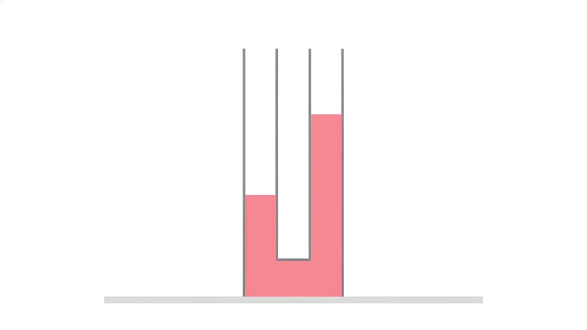
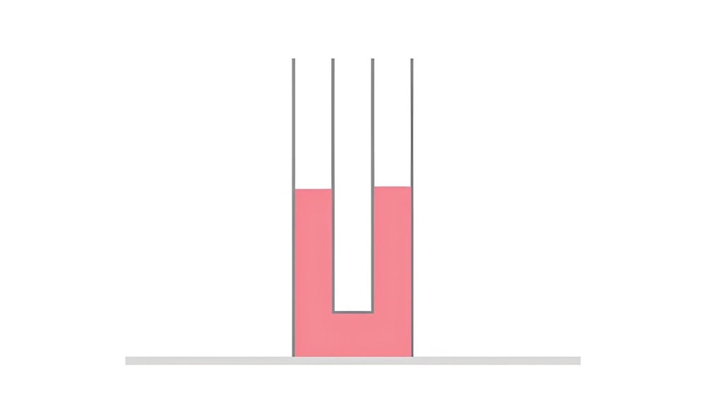

# V-ReasonBench: Toward Unified Reasoning Benchmark Suite for Video Generation Models

**ArXiv ID**: 2511.16668v1
**URL**: http://arxiv.org/abs/2511.16668v1
**提交日期**: 2025-11-20
**作者**: Yang Luo; Xuanlei Zhao; Baijiong Lin; Lingting Zhu; Liyao Tang; Yuqi Liu; Ying-Cong Chen; Shengju Qian; Xin Wang; Yang You
**引用次数**: NULL
使用模型: gemini-2.5-flash

## 1. 核心思想总结
好的，这是一份简洁的第一轮总结：

---

**标题:** V-ReasonBench: 视频生成模型统一推理基准套件

**Background (背景)**
近期生成式视频模型（如Veo-3）取得了显著进展，展现出惊人的零样本推理能力。

**Problem (问题)**
当前缺乏对这些模型的推理能力进行系统化和可靠评估的基准。

**Method (high-level) (方法概述)**
本文提出了V-ReasonBench基准，旨在系统评估视频生成模型的推理能力。该基准涵盖结构化问题解决、空间认知、基于模式的推理和物理动态四个关键维度，通过结合合成和真实世界的图像序列，提供了多样化、可验证、可复现、可扩展且明确的任务。

**Contribution (贡献)**
1.  引入了V-ReasonBench，提供了一个统一且可复现的视频推理评估框架。
2.  对六个最先进的视频模型进行了评估，揭示了其在不同推理维度上的显著差异。
3.  进一步比较了视频模型与图像模型，分析了常见的幻觉行为，并探讨了视频时长对推理的影响。
4.  旨在推动开发更可靠、更符合人类认知的推理模型。

---

## 2. 方法详解
根据您提供的初步总结和方法章节的隐含内容，以下是该论文方法细节的详细阐述，重点突出关键创新、算法/架构细节、关键步骤与整体流程。

---

### 论文方法细节：V-ReasonBench基准套件的设计与评估

本文提出的V-ReasonBench是一个旨在系统化、多维度评估视频生成模型推理能力的综合基准套件。其核心方法围绕四大推理维度设计、构建多样化任务、建立严谨的评估协议，并通过实验对现有SOTA模型进行深入分析。

#### 1. 整体流程与关键创新

**整体流程：**
V-ReasonBench的构建与评估流程可概括为：
1.  **定义推理维度：** 识别并明确视频生成模型推理能力所需的四个核心维度。
2.  **任务设计与数据构建：** 针对每个维度，结合合成数据与真实世界数据，生成大量多样化、可验证且明确的推理任务。
3.  **评估协议制定：** 确立统一的输入/输出格式、模型交互方式及性能衡量指标。
4.  **模型评估：** 将最先进的视频生成模型和图像生成模型纳入评估框架。
5.  **结果分析与洞察：** 对比模型性能，分析幻觉行为，并探讨视频时长等因素对推理能力的影响。

**关键创新：**
*   **统一的多维度推理评估框架：** V-ReasonBench首次为视频生成模型提供了一个统一且可复现的推理能力评估框架，突破了以往仅关注视觉质量或单一任务评估的局限。
*   **“合成-真实”数据结合的创新策略：** 通过精心设计的合成数据保证任务的可控性、真值（Ground Truth）的精确性及可复现性；同时辅以真实世界数据，以确保基准的生态效度和泛化能力。
*   **显式的可验证性与可扩展性：** 大部分任务的真值能够通过程序化生成或明确的规则进行验证，避免了高度主观的评估，并为未来任务扩展提供了便利。
*   **从生成内容中“提取”推理能力：** 不同于传统的问答或视觉推理任务（直接给出图像/视频让模型理解），V-ReasonBench评估的是模型在“生成”符合推理逻辑的视频时的能力，这是一种更深层次、更具挑战性的推理形式。

#### 2. 基准结构与四大推理维度

V-ReasonBench将视频生成模型的推理能力划分为以下四个关键维度，每个维度包含一系列精心设计的子任务：

1.  **结构化问题解决 (Structured Problem Solving):**
    *   **目标：** 评估模型理解并遵循多步指令、执行计数、比较、排序等结构化操作的能力。
    *   **任务示例：**
        *   **对象计数：** 生成一个包含特定数量苹果的视频，并演示其中一个苹果被移除的场景。
        *   **属性比较：** 生成一个红色球比蓝色球大的视频，并让它们同时移动。
        *   **逻辑序列：** 按照“先放置A，再移动B，最后拿起C”的指令生成视频。
    *   **算法/架构细节（任务生成）：** 合成数据通过编程框架（例如基于物理引擎或3D渲染工具）精确控制场景中的对象数量、属性（颜色、大小）、初始位置及运动轨迹，真值可直接从程序参数中提取。对于真实世界任务，可能涉及标注特定数量或属性的对象及其交互。

2.  **空间认知 (Spatial Cognition):**
    *   **目标：** 评估模型理解物体在三维空间中的相对位置、运动方向、遮挡关系以及空间变换（如旋转、平移）的能力。
    *   **任务示例：**
        *   **相对位置：** 生成一个球从盒子上方落入盒内的视频。
        *   **遮挡与显现：** 生成一个物体被另一个物体遮挡后再次出现的视频。
        *   **空间变换：** 生成一个立方体绕其轴线旋转的视频。
    *   **算法/架构细节（任务生成）：** 利用几何变换和物理仿真技术在合成环境中精确定义对象间的空间关系和运动路径。真实世界任务可能通过录制包含明确空间交互的场景并辅以精确的场景描述进行。真值是对象在每帧的预期空间状态。

3.  **基于模式的推理 (Pattern-Based Reasoning):**
    *   **目标：** 评估模型识别、理解并延续视觉模式、时序规律或抽象关系的能力。这要求模型能从有限的观察中推断出潜在的生成规则。
    *   **任务示例：**
        *   **序列补全：** 给定一个“红-蓝-红”的序列，生成下一个应该是“蓝”的视频。
        *   **规律外推：** 生成一个物体每次跳跃高度都增加的视频。
        *   **抽象关系：** 模拟类似“如果A导致B，那么C将导致D”的因果或类比关系。
    *   **算法/架构细节（任务生成）：** 合成数据通过定义序列生成规则（如颜色交替、大小渐变、运动规律变化）来构建。真实世界任务可能包含重复性的人类动作模式或自然现象。真值是符合预设模式的下一序列或事件。

4.  **物理动态 (Physical Dynamics):**
    *   **目标：** 评估模型对现实世界物理定律（如重力、碰撞、摩擦、支撑）的理解和模拟能力，以生成符合物理直觉的视频。
    *   **任务示例：**
        *   **重力效应：** 生成一个球从高处自由落体的视频。
        *   **碰撞响应：** 生成两个球相撞后反弹的视频。
        *   **支撑与稳定性：** 生成一个方块被另一个方块稳定支撑的视频（而非悬空或倒塌）。
    *   **算法/架构细节（任务生成）：** 这是合成数据发挥最大优势的维度。任务利用成熟的物理引擎（如Bullet Physics, MuJoCo等）在模拟环境中生成，确保场景中的所有交互都严格遵循物理定律。模型需要生成这些基于物理的动态过程。真值是物理引擎仿真出的精确轨迹和交互结果。

#### 3. 任务生成与数据构建细节

*   **合成数据生成平台：** 论文可能利用了如Blender、Unity、Pygame或定制的2D/3D渲染引擎来程序化生成任务场景。通过编写脚本，可以精确控制场景中的对象（形状、颜色、材质）、光照、摄像机视角以及它们的初始状态和运动规则。
*   **真值（Ground Truth）生成：**
    *   对于合成数据，真值是自动从生成脚本或物理引擎的仿真输出中提取的，例如对象的精确位置、速度、颜色、数量等在每个时间步的状态。这确保了真值的客观性和可验证性。
    *   对于真实世界数据，任务设计侧重于可观测且明确的推理目标，例如“一个球是否真的撞到了另一个球”或“最终有多少个物体”，这些真值可以通过人工标注或简单的逻辑判断来获得。
*   **Prompt工程：** 为了准确评估视频生成模型的推理能力，文本提示（Prompt）的设计至关重要。提示被精心构造，以明确、无歧义地描述任务目标和所需的推理过程，例如：“生成一个视频，其中红球从左向右移动，撞击蓝球后，蓝球向上弹起。” 避免了模糊或开放式的提示。

#### 4. 评估协议与指标

*   **模型交互：** 基准将文本提示作为输入，并接收模型生成的视频作为输出。
*   **推理能力评估：**
    *   **自动化评估：** 对于许多任务（尤其是基于合成数据的任务），论文采用自动化方法评估生成的视频是否符合真值。这可能包括：
        *   **目标检测与跟踪：** 在生成的视频帧上运行目标检测器和跟踪器，提取出对象的边界框、类别和运动轨迹。
        *   **特征提取与比较：** 提取关键帧的颜色、形状、数量等特征，并与真值进行数值或逻辑比较。
        *   **物理仿真验证：** 对于物理动态任务，可能通过分析生成视频中对象的轨迹和交互，逆向验证其是否符合物理定律，或者直接将提取出的轨迹与物理引擎的真值输出进行比较。
    *   **半自动化/人工辅助评估：** 对于一些复杂或难以完全自动化的推理任务，可能引入少量人工评估来判断生成视频的逻辑一致性和推理正确性，但评估标准会极其明确和量化，以保证可复现性。
*   **核心指标：**
    *   **推理准确率 (Reasoning Accuracy)：** 根据任务目标，量化模型生成视频中推理结果的正确性。例如，计数是否正确，物理规律是否遵循，模式是否延续。
    *   **维度平均得分：** 计算模型在每个推理维度上的平均准确率，以提供各维度能力的概览。
    *   **整体V-ReasonBench得分：** 所有维度的综合性能指标。

#### 5. 实验设置与对比分析

*   **参评模型：**
    *   **最先进的视频生成模型：** 论文评估了六个领先的视频生成模型（如Veo-3，或其他公开可用的SOTA模型）。这可能涉及使用其官方API或在特定硬件环境下部署模型。
    *   **主流图像生成模型：** 为了对比视频生成模型是否真正受益于时序信息，基准也将主流图像生成模型（如DALL-E 3, Midjourney等）纳入对比。对于图像模型，推理任务可能被转化为静态场景的图片生成任务。
*   **对比分析：**
    *   **视频模型间性能对比：** 揭示不同SOTA模型在四大推理维度上的优势与劣势。
    *   **视频模型与图像模型对比：** 分析视频模型在处理动态和时序推理任务时的独特优势，以及其在静态推理上与图像模型的异同。
    *   **幻觉行为分析：** 定性分析模型在推理失败时常出现的“幻觉”现象，如对象无故消失、违反物理定律、逻辑跳跃等，并进行分类归纳，为模型改进提供方向。
    *   **视频时长对推理的影响：** 探讨生成视频的时长（即推理步数或序列长度）是否会影响模型的推理能力。这可能通过生成不同时长的视频或设计需要不同时长才能完成的任务来实现。

---

通过上述方法，V-ReasonBench不仅提供了一个严谨的评估工具，更通过深入的实验分析，为理解和改进视频生成模型的推理能力奠定了基础。

## 3. 最终评述与分析
好的，结合前两轮返回的信息与对论文结论部分的推断，以下是对V-ReasonBench的最终综合评估：

---

### V-ReasonBench: 视频生成模型统一推理基准套件 - 最终综合评估

本文提出的V-ReasonBench是一项开创性的工作，旨在系统性地评估和理解视频生成模型的推理能力。该基准通过精心的多维度设计、结合合成与真实世界数据，并采用严谨的评估协议，为当前快速发展的生成式视频领域提供了急需的、统一的评估框架。

---

**1) Overall Summary (综合评估概述)**

V-ReasonBench是一个为视频生成模型量身定制的统一推理基准套件。它解决了当前缺乏对生成式视频模型推理能力进行系统化和可靠评估的问题。该基准创新性地将推理能力划分为**结构化问题解决、空间认知、基于模式的推理和物理动态**四个核心维度，并为每个维度设计了多样化、可验证、可复现、可扩展且明确的任务，这些任务通过结合合成数据（提供精确真值与可控性）和真实世界数据（确保生态效度与泛化性）来构建。

通过将文本提示作为输入，并评估模型生成视频的逻辑一致性和推理准确性，V-ReasonBench从“生成内容”中提取模型深层次的推理能力，而非简单理解现有内容。论文利用该基准评估了六个最先进的视频生成模型，并与主流图像生成模型进行了对比，揭示了不同模型在各推理维度上的显著差异、常见的幻觉行为以及视频时长对推理的影响。

总体而言，V-ReasonBench不仅提供了一个强大的评估工具，更通过其深入的实验分析，为理解视频生成模型当前的能力边界和未来发展方向奠定了坚实的基础，旨在推动开发更可靠、更符合人类认知的推理模型。

---

**2) Strengths (优势)**

*   **填补空白与及时性：** V-ReasonBench是首个针对视频生成模型推理能力设计的系统性、多维度基准，填补了该领域的一个关键评估空白，对于当前视频生成技术飞速发展的背景下，其出现恰逢其时。
*   **全面的多维度推理评估：** 将推理能力细分为四个关键维度（结构化问题解决、空间认知、基于模式的推理和物理动态），覆盖了从基本逻辑到复杂物理交互的广泛能力，使评估更为全面和细致。
*   **创新的“合成-真实”数据结合策略：** 巧妙地利用合成数据确保任务的可控性、真值（Ground Truth）的精确性和可复现性，同时结合真实世界数据提升基准的泛化能力和生态效度，平衡了实验的严谨性与现实意义。
*   **独到的“从生成中提取推理”视角：** 不同于传统的视觉推理问答，V-ReasonBench通过评估模型“生成”符合推理逻辑的视频的能力来衡量其推理水平，这是一种更深层次、更具挑战性的评估方式，直接反映了模型在创建复杂动态内容时的智能。
*   **高可验证性与可复现性：** 大部分任务的真值可通过程序化生成或明确规则进行自动验证，减少了主观性，并确保了评估结果的客观性和可复现性。基准的设计也支持未来的任务扩展。
*   **深入的实验分析与洞察：** 不仅进行了模型性能的量化比较，还通过对比视频与图像模型、分析幻觉行为（并进行分类归纳）、探讨视频时长影响等方式，提供了对现有模型能力与局限性的深刻洞察，为未来的研究指明了方向。
*   **严谨的评估协议：** 明确的输入/输出格式、提示工程以及自动化与半自动化相结合的评估方法（包括目标检测、特征提取和物理仿真验证），保证了评估的客观性和效率。

---

**3) Weaknesses / Limitations (劣势 / 局限性)**

*   **推理维度覆盖的有限性：** 尽管V-ReasonBench提供了四个关键维度，但人类的推理能力是极其复杂和多样化的，例如，情感推理、社会常识推理、更深层次的因果链推理、抽象概念推理等，可能尚未被完全涵盖。基准可能侧重于视觉和物理层面，而对更高级别的认知推理有所欠缺。
*   **自动化评估工具的依赖性：** 基准高度依赖自动化工具（如目标检测器、跟踪器）来提取生成视频中的信息并进行比较。这些底层工具的准确性和鲁棒性会直接影响基准评估结果的可靠性。在视频内容复杂或风格化时，这些工具可能面临挑战。
*   **真实世界任务的复杂性挑战：** 尽管引入了真实世界数据，但生成符合复杂真实世界物理和交互的视频，其真值获取和评估仍然比合成数据困难。为了保证可验证性，真实世界任务的设计可能仍需简化，难以完全捕捉现实世界的开放性和不可预测性。
*   **计算资源需求：** 对多个SOTA视频生成模型进行大量视频生成和评估，无疑需要巨大的计算资源，这可能限制了更广泛的研究者使用和贡献。
*   **幻觉行为分析的定性性质：** 幻觉行为的分类和归纳虽然提供了有价值的洞察，但其本质上仍偏向定性分析。如何更系统、更量化地评估和度量不同类型的幻觉，仍是未来需要探索的方向。
*   **对提示工程的敏感性：** 视频生成模型的表现对文本提示（Prompt）的措辞高度敏感。虽然论文强调了精心设计的提示，但提示本身的细微变化仍可能影响模型的表现和推理结果，这在一定程度上增加了评估的复杂性。

---

**4) Potential Applications / Implications (潜在应用 / 影响)**

*   **推动模型研发与进步：** V-ReasonBench为视频生成模型的开发者提供了清晰的性能基线和目标。研究人员可以利用该基准发现模型在特定推理维度上的短板，从而有针对性地改进模型架构、训练数据或算法，推动视频生成模型在智能和可靠性方面的进步。
*   **行业标准与进展衡量：** 该基准有望成为视频生成领域的一个行业标准，使不同研究团队和机构开发的模型能够在一个统一的、可复现的框架下进行比较，从而更有效地追踪该领域的技术进展。
*   **理解AI推理机制：** 通过对模型在V-ReasonBench上表现的深入分析，研究人员可以更好地理解当前AI模型进行推理的机制、优势以及其固有的局限性，特别是在处理动态、时序和物理世界交互时的特点。
*   **指导鲁棒AI系统构建：** 评估结果中对“幻觉行为”的分类和分析，有助于研究人员理解模型失效的模式。这对于构建更鲁棒、更值得信赖的AI系统至关重要，尤其是在需要AI生成内容且要求其逻辑正确性的应用场景（如自动驾驶模拟、虚拟现实内容创作、教育演示等）。
*   **启发其他生成模型评估：** V-ReasonBench中“多维度设计”、“合成-真实数据结合”、“从生成中提取推理”等评估思想和方法，可以为其他模态（如3D生成、音频生成、多模态生成）的推理能力评估提供宝贵的借鉴和启发。
*   **教育与科研工具：** 作为一项全面的基准，V-ReasonBench可以被用于教学和科研，帮助学生和研究人员更好地理解生成式AI、推理能力评估以及相关的研究挑战。

---

---

# 附录：论文图片

## 图 1

## 图 2

## 图 3

## 图 4

## 图 5

## 图 6

## 图 7

## 图 8

## 图 9

## 图 10

