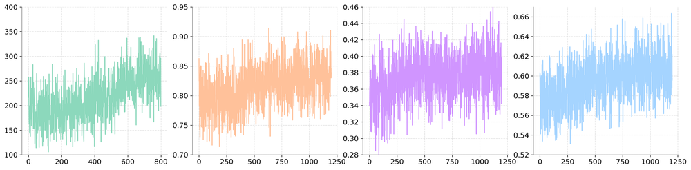
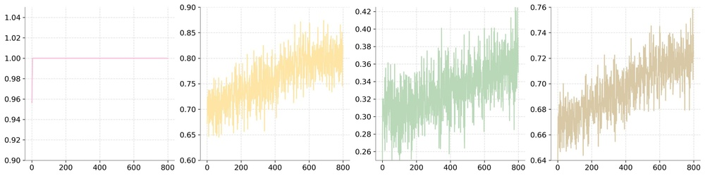
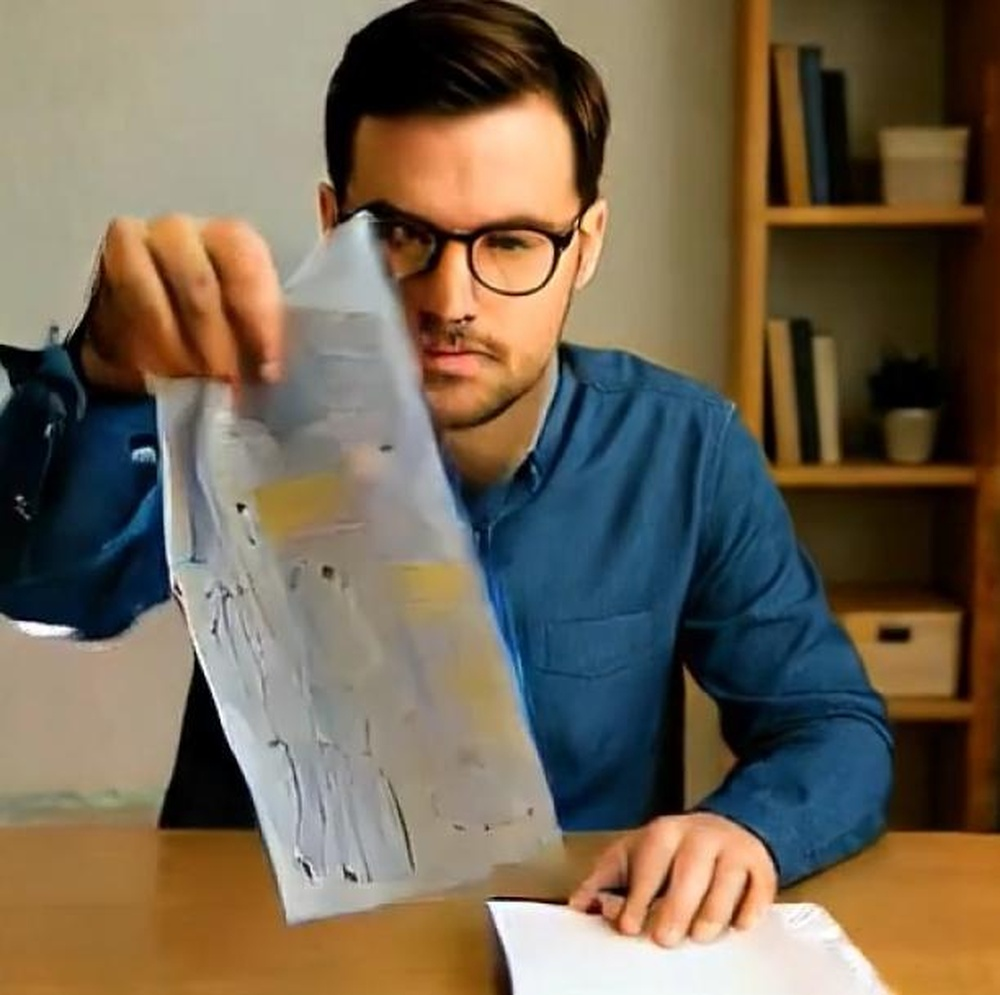
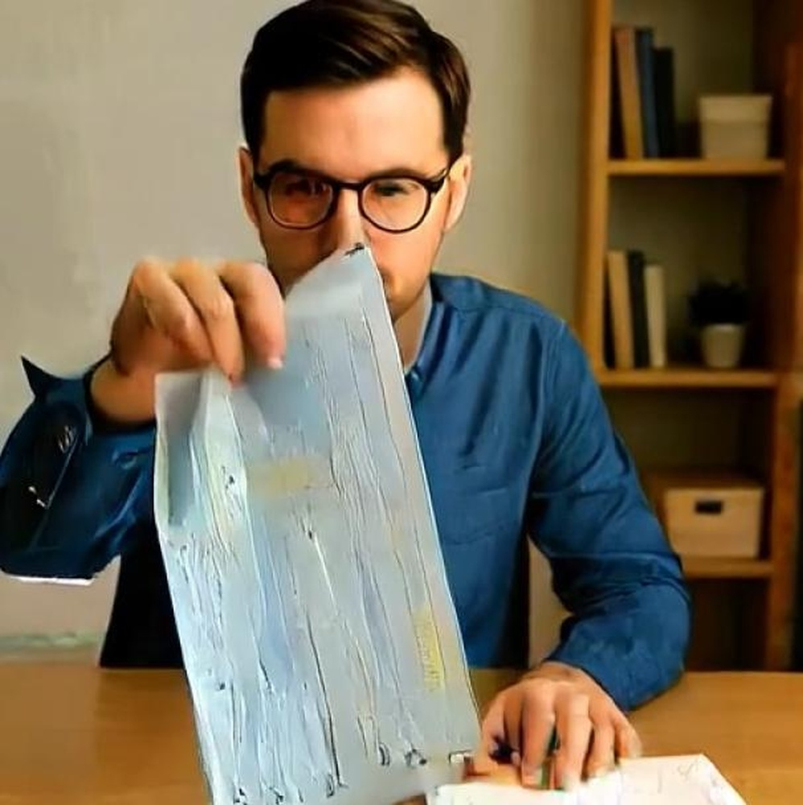

# Video-as-Answer: Predict and Generate Next Video Event with Joint-GRPO

**ArXiv ID**: 2511.16669v1
**URL**: http://arxiv.org/abs/2511.16669v1
**提交日期**: 2025-11-20
**作者**: Junhao Cheng; Liang Hou; Xin Tao; Jing Liao
**引用次数**: NULL
使用模型: gemini-2.5-flash

## 1. 核心思想总结
作为学术论文分析专家，以下是针对您提供摘要的简洁第一轮总结：

---

**标题:** Video-as-Answer: Predict and Generate Next Video Event with Joint-GRPO

**背景 (Background):**
*   语言模型已广泛应用，但视频生成仍主要限于娱乐领域。
*   视频在展示语言难以表达的物理世界信息（如系领带）方面具有独特优势。
*   现有下一事件预测（NEP）任务以文本形式预测下一事件。本文旨在将视频作为一种新的答案模态，扩展为视频下一事件预测（VNEP）。

**问题 (Problem):**
*   VNEP任务要求模型生成动态视频响应，而非简单的文本输出，以提供更直观、定制化的答案。
*   现有模型难以应对此任务，因为它需要理解多模态输入、基于指令的推理，并生成视觉和语义上一致的视频。

**方法 (Method - high-level):**
*   提出VANS模型，利用强化学习（RL）对视觉-语言模型（VLM）与视频扩散模型（VDM）进行对齐，以解决VNEP任务。
*   核心是提出的联合GRPO（Joint-GRPO）机制，协同VLM和VDM作为一个整体运行。
*   通过共享奖励驱动，联合GRPO优化VLM以生成准确且易于可视化的字幕，并指导VDM生成忠实于这些字幕和输入视觉上下文的视频。
*   构建了专用的VANS-Data-100K数据集以支持模型学习。

**贡献 (Contribution):**
*   提出了视频下一事件预测（VNEP）这一新的任务范式。
*   引入了VANS模型及其核心的联合GRPO机制，有效协调VLM和VDM以生成高质量视频答案。
*   构建了首个VNEP专用数据集VANS-Data-100K。
*   实验证明VANS在视频事件预测和可视化方面均达到SOTA性能，实现了更直观、定制化的程序学习和创意探索。

## 2. 方法详解
好的，基于您提供的初步总结，并结合学术论文方法章节的常见结构和深度，以下是对该论文方法细节的详细阐述：

---

### 方法 (Methodology)

本文提出的 **VANS (Video-as-Answer System)** 模型旨在解决视频下一事件预测 (VNEP) 任务，即不仅要预测下一事件的语义内容，还要将其生成为动态视频响应。VANS模型的核心在于其独特的两阶段架构以及通过 **联合广义策略优化 (Joint-GRPO)** 强化学习机制实现的端到端对齐与训练。

#### 1. VANS系统整体架构

VANS系统由两大核心模块组成：一个**视觉-语言模型 (VLM)** 和一个**视频扩散模型 (VDM)**。这两个模型协同工作，通过一种共享的强化学习奖励信号进行优化，以确保生成的视频答案既准确又具有视觉吸引力。

*   **VLM (Visual-Language Model)**：负责理解输入的视频序列，并预测下一事件的语义内容，将其转化为清晰、可生成的文本描述（即字幕或指令）。
*   **VDM (Video Diffusion Model)**：接收VLM生成的文本描述以及原始输入视频的视觉上下文，进而生成与文本描述和上下文高度一致的下一事件视频片段。
*   **联合GRPO (Joint-GRPO) 机制**：作为VANS的优化核心，它协调VLM和VDM，将它们作为一个整体进行强化学习训练，确保VLM生成的字幕最有利于VDM生成高质量视频，同时VDM能忠实地根据字幕和输入视觉上下文生成视频。

#### 2. 核心模块详解

##### 2.1 视觉-语言模型 (VLM) for Event Prediction

*   **功能定位**：VLM在VANS中扮演着“事件预测器”和“视频生成指导者”的角色。它不仅要准确理解当前视频序列中蕴含的意图和潜在行动，还要将这种理解转化为对下一事件的简洁、具体且高度可视觉化的文本描述。
*   **输入**：一段先前发生的视频序列。这通常是一个多帧的视频剪辑，编码器需要从中提取时空特征。
*   **输出**：一段描述下一事件的文本字幕。这个字幕的质量（准确性、描述性、可生成性）直接影响后续VDM的视频生成效果。
*   **内部机制推断**：
    *   **视频编码器**：可能采用Swin Transformer、ViT等强大的视频特征提取网络，将输入的视频帧序列编码为一系列时空特征表示。
    *   **语言解码器**：基于编码器提取的视频特征，采用Transformer解码器架构（如GPT-like模型）生成文本字幕。该解码器需要具备根据视觉输入生成连贯、有意义文本的能力。
    *   **关键创新点**：在Joint-GRPO的驱动下，VLM不仅仅是生成“正确”的字幕，而是生成“最容易让VDM生成高质量视频”的字幕。这意味着VLM会学习生成更具描述性、更具体、更适合作为视频生成prompt的文本。

##### 2.2 视频扩散模型 (VDM) for Video Generation

*   **功能定位**：VDM是VANS中的“视频创作者”，它负责将VLM提供的语义指令（字幕）与当前视觉上下文相结合，合成出与预测事件对应的动态视频。
*   **输入**：
    1.  VLM生成的下一事件文本字幕。
    2.  输入视频序列的最后一帧或其提取的特征（用于保持视觉一致性和场景连续性）。
*   **输出**：一段表示预测的下一事件的视频片段。
*   **内部机制推断**：
    *   **扩散骨干网络**：基于U-Net结构的3D卷积或Transformer块，能够处理时空数据。通过逐步去噪过程，将随机噪声转化为结构化的视频帧。
    *   **条件机制**：
        *   **文本条件**：通过交叉注意力机制，将VLM生成的文本字幕（经过文本编码器如CLIP text encoder处理）融入扩散模型的各层，引导视频内容与字幕语义对齐。
        *   **视觉条件**：通过条件输入、嵌入或残差连接等方式，将输入视频的视觉特征（特别是末尾帧的特征）提供给VDM，确保生成的视频与前一个视频片段在视觉风格、场景布局和物体一致性上保持连贯。
    *   **时间建模**：扩散模型内部需要包含能够捕捉时间依赖性和运动信息的模块，以生成平滑、自然的视频帧序列。

#### 3. 关键创新：联合广义策略优化 (Joint-GRPO) 强化学习机制

联合GRPO是VANS模型的核心创新，它解决了VLM和VDM之间固有的模态差异和联合优化难题，实现了端到端的系统性能提升。

*   **问题背景**：独立训练的VLM可能生成语义正确的字幕，但这些字幕可能对VDM来说难以生成高质量视频；而独立训练的VDM可能生成高质量视频，但无法保证其语义与VLM的预测完全匹配。传统的两阶段监督学习方法难以确保最终视频答案的整体质量和连贯性。
*   **核心思想**：将VLM和VDM视为一个统一的策略（policy），通过强化学习方法，以**共享的奖励信号**对整个系统进行优化。这种方法使得VLM和VDM能够相互适应，形成一种“共生”关系。
*   **GRPO (Generalized Policy Optimization)**：这是一种基于策略梯度 (Policy Gradient) 的强化学习算法，其优势可能在于能够处理复杂的模型结构（VLM和VDM的串联），并提供相对稳定的训练过程。它通过优化一个广义策略目标来最大化期望奖励。
*   **共享奖励驱动**：这是Joint-GRPO的关键。奖励函数不是分别评价VLM的文本输出和VDM的视频输出，而是**综合评价VDM生成的最终视频**。这个奖励信号被回传到VLM和VDM的参数更新中。
    *   **奖励函数的构成（推测）**：
        *   **视频质量奖励**：衡量生成视频的逼真度、清晰度、流畅度（例如，基于FID、FVD等指标的代理奖励，或基于感知质量的神经网络评价）。
        *   **语义一致性奖励**：评估生成视频与VLM所预测字幕之间的语义匹配程度（例如，使用CLIP得分来衡量视频特征与文本特征的相似度）。
        *   **时序连贯性奖励**：确保生成视频与输入视频在视觉和动作上的平滑衔接（例如，比较输入视频末帧和生成视频首帧的特征相似度，或评估动作轨迹的连续性）。
        *   **VNEP任务准确性奖励**：与真实世界下一事件视频的匹配程度（例如，基于高级语义特征的对比或分类准确性）。
*   **优化过程**：
    1.  **VLM的优化**：VLM学会生成那些能导致VDM产生高奖励视频的字幕。它不再仅仅追求字幕的“文本正确性”，而是追求“视频生成友好性”。
    2.  **VDM的优化**：VDM学会更好地根据VLM提供的字幕和视觉上下文，生成符合所有奖励标准的视频。

#### 4. 训练流程

1.  **数据集构建**：论文构建了首个VNEP专用数据集 **VANS-Data-100K**。该数据集包含大量的视频事件序列，每个序列都附带了下一事件的真实视频片段及其对应的文本描述。这对于训练多模态模型至关重要。
2.  **预训练（推测）**：为了提供良好的初始化，VLM和VDM可能在大型、通用的视觉-语言和视频生成数据集上进行预训练。
    *   VLM：可能在视频描述、视频问答等任务上预训练。
    *   VDM：可能在文本到视频生成、无条件视频生成等任务上预训练。
3.  **联合强化学习微调**：在VANS-Data-100K数据集上，通过Joint-GRPO机制对整个VANS系统进行端到端微调。
    *   **迭代过程**：
        1.  从数据集中采样一个输入视频序列。
        2.  VLM根据输入序列预测并生成下一事件的文本字幕。
        3.  VDM根据VLM生成的字幕和输入视频上下文生成下一事件的视频。
        4.  计算基于生成视频的共享奖励信号。
        5.  利用GRPO算法，根据奖励信号更新VLM和VDM的参数。

#### 5. 整体流程总结（推理阶段）

1.  用户向VANS系统输入一段视频片段，作为上下文信息。
2.  VANS系统内的VLM模块首先分析该输入视频，理解当前事件并预测下一事件的语义，并将其输出为一段简洁的文本描述（字幕）。
3.  随后，VDM模块接收到这段文本字幕以及原始输入视频的视觉上下文。
4.  VDM根据这些输入，合成并生成一段新的视频片段，该片段精确地可视化了VLM所预测的下一事件。
5.  最终，系统将生成的视频片段作为“视频答案”呈现给用户。

通过上述方法，VANS模型能够突破传统文本预测的局限，提供更直观、定制化的视频化解决方案，在程序学习和创意探索等领域展现出巨大潜力。

## 3. 最终评述与分析
好的，结合前两轮的详细信息，以下是针对该论文的最终综合评估：

---

### 最终综合评估

#### 1) 总体总结 (Overall Summary)

该论文《Video-as-Answer: Predict and Generate Next Video Event with Joint-GRPO》提出并成功解决了**视频下一事件预测（VNEP）**这一全新的任务范式。与传统的文本形式下一事件预测不同，VNEP旨在直接生成对下一事件的动态视频响应。为实现这一目标，论文引入了创新的 **VANS (Video-as-Answer System)** 模型。VANS系统巧妙地结合了**视觉-语言模型 (VLM)** 和 **视频扩散模型 (VDM)**，并通过其核心的 **联合广义策略优化 (Joint-GRPO)** 强化学习机制进行端到端对齐和训练。VLM负责将输入视频转换为对下一事件的“视频生成友好型”文本描述，而VDM则依据此文本描述和输入视频的视觉上下文生成高质量的下一事件视频。为了支持VNEP任务，论文还构建了首个专用数据集 **VANS-Data-100K**。实验结果表明VANS在视频事件预测和可视化方面均达到了SOTA性能，为提供更直观、定制化的信息展示和交互方式开辟了新路径。

#### 2) 优势 (Strengths)

1.  **任务范式创新性 (Novel Task Paradigm):** 首次明确提出并解决了“视频作为答案”的下一事件预测任务 (VNEP)，这超越了传统的文本预测范畴，为机器理解和生成物理世界信息提供了更直观、更丰富的新模态。
2.  **模型架构的巧妙整合 (Ingenious Model Architecture):** VANS系统通过VLM和VDM的协同工作，将语义理解和视频生成两大复杂任务有机结合。VLM作为“智能翻译官”，将抽象的事件预测转化为可供VDM操作的具体指令，而VDM则作为“高效创作者”，将指令和上下文转化为生动的视频。
3.  **核心优化机制的创新 (Innovative Core Optimization Mechanism):** Joint-GRPO强化学习机制是该研究的突出亮点。它有效地解决了VLM和VDM之间固有的模态差异和联合优化难题，通过共享的、以最终视频质量为导向的奖励信号，促使两个模块相互适应、协同进化，从而确保了整个系统输出视频的整体高质量和语义一致性。
4.  **高质量数据集的贡献 (High-Quality Dataset Contribution):** VANS-Data-100K数据集的构建填补了VNEP研究领域的空白，为模型的训练和后续研究提供了坚实基础。这对于推动该领域的发展至关重要。
5.  **显著的实际应用潜力 (Significant Practical Application Potential):** 视频作为答案的呈现方式更符合人类的直观认知和学习习惯，在教学、指导、创意内容生成等多个领域具有巨大的应用价值。
6.  **先进技术的融合 (Integration of Advanced Technologies):** 该工作成功地将视觉-语言模型、视频扩散模型和强化学习等前沿技术结合起来，展现了在多模态AI领域的强大技术实力。

#### 3) 劣势 / 局限性 (Weaknesses / Limitations)

1.  **高计算资源需求 (High Computational Resource Demand):** VLM、VDM以及基于强化学习的训练过程都极其复杂且计算密集。训练和部署这样的模型需要庞大的计算资源（GPU、存储），这限制了其广泛应用和研究的可及性。
2.  **数据依赖性与泛化能力挑战 (Data Dependence and Generalization Challenges):** 尽管VANS-Data-100K数据集规模不小，但真实世界的事件序列和视觉场景是无限多样且开放的。模型在面对训练数据之外的、高度新颖或复杂的事件时，其预测和生成视频的准确性、连贯性和多样性可能受到限制。
3.  **错误累积与鲁棒性问题 (Error Accumulation and Robustness Issues):** VANS系统是串联的，VLM的任何语义理解偏差或字幕生成错误都可能沿着链条传递给VDM，导致最终生成的视频出现不准确或不连贯的问题。尽管Joint-GRPO旨在缓解，但难以完全消除这种链式错误传播的风险。
4.  **评估的复杂性与主观性 (Complexity and Subjectivity of Evaluation):** 视频生成质量的客观评估标准仍在发展中，如FID、FVD等指标并不能完全捕捉人类对视频的感知质量和语义准确性。因此，评估生成的视频答案在视觉真实性、语义一致性和时序连贯性方面仍需依赖大量主观的人工评估。
5.  **解释性与可控性不足 (Lack of Interpretability and Controllability):** 作为一个复杂的深度学习系统，尤其是加入了强化学习，VANS模型具有一定的黑盒性质。难以精确解释模型为何会做出特定的预测或生成特定的视频片段，这在需要高可靠性和透明度的应用场景中可能是一个局限。
6.  **潜在的伦理风险 (Potential Ethical Risks):** 视频生成技术本身带有生成误导性信息或“深度伪造”的风险。虽然VNEP任务的直接目的并非如此，但作为一种强大的视频生成工具，其滥用可能性仍需引起关注。

#### 4) 潜在应用 / 影响 (Potential Applications / Implications)

1.  **智能教学与技能学习 (Smart Education and Skill Learning):**
    *   **"How-to" 指导:** 用户提出问题（例如：“如何打领带？”或“下一步该如何组装？”），系统直接生成详细的视频教程，而非文本步骤。
    *   **虚拟教练:** 在运动训练、乐器学习中，预测并展示下一步动作的标准示范。
    *   **程序化知识可视化:** 将复杂的操作手册、维修指南等转化为直观的视频演示。
2.  **创意内容生成与预可视化 (Creative Content Generation and Pre-visualization):**
    *   **电影/游戏故事板生成:** 编剧或导演输入剧本片段或场景描述，系统自动生成下一镜头的初步视频草稿。
    *   **广告创意设计:** 帮助营销人员快速可视化不同的广告场景和情节发展。
    *   **元宇宙与虚拟世界内容创作:** 自动化生成虚拟场景中的事件序列和角色互动。
3.  **机器人与自动化系统 (Robotics and Automation Systems):**
    *   **机器人任务规划可视化:** 机器人接收指令后，系统预测并生成机器人完成任务（如抓取、移动）的下一步动作视频，辅助操作员进行监控和调整。
    *   **环境变化预测:** 在自动驾驶或智能监控系统中，预测特定事件（如行人下一步走向、车辆下一步变道）的发生，并以视频形式预警。
4.  **智能助手与人机交互 (Smart Assistants and Human-Computer Interaction):**
    *   **多模态问答系统:** 扩展现有智能助手的功能，使其不仅能回答文本或图片，还能提供动态视频作为答案，实现更自然、更丰富的交互体验。
    *   **辅助残障人士:** 为视觉或认知障碍者提供更直观的视频信息，替代难以理解的文本或静态图像。
5.  **安全与监控 (Security and Surveillance):**
    *   **事件预警:** 在安全监控中，预测潜在的异常行为或危险事件的下一步发展，并以视频形式警示操作员。
    *   **犯罪现场重建:** 根据现有线索预测和可视化事件发生的可能路径。

总体而言，VANS模型及其提出的VNEP任务在推动人工智能从单一模态理解和生成向多模态、动态化交互迈进方面具有里程碑意义。它不仅在技术上实现了显著突破，更在实际应用层面展示了重塑人类获取信息、学习技能和进行创意表达的巨大潜力。

---

# 附录：论文图片

## 图 1

## 图 2

## 图 3

## 图 4

## 图 5

## 图 6

## 图 7

## 图 8

## 图 9

## 图 10

