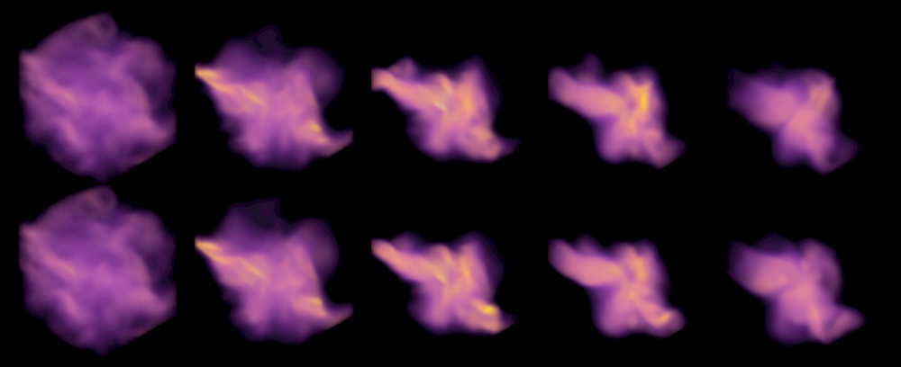
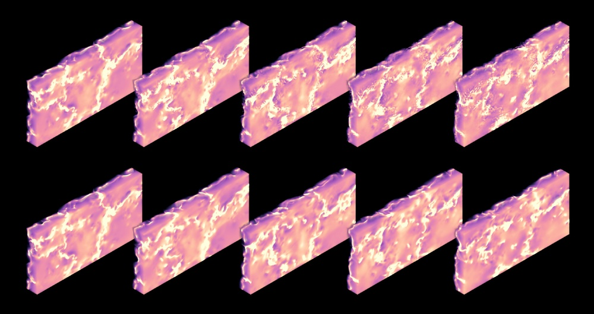
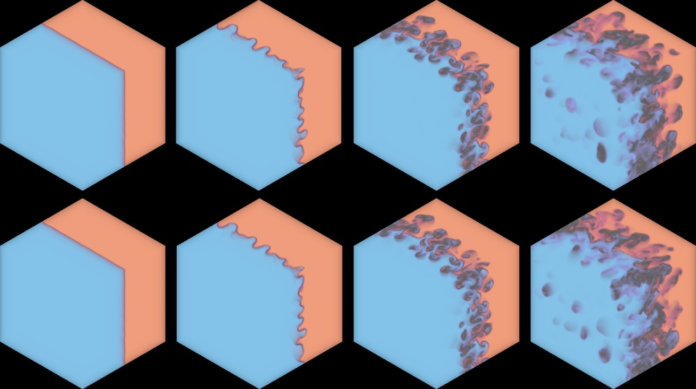
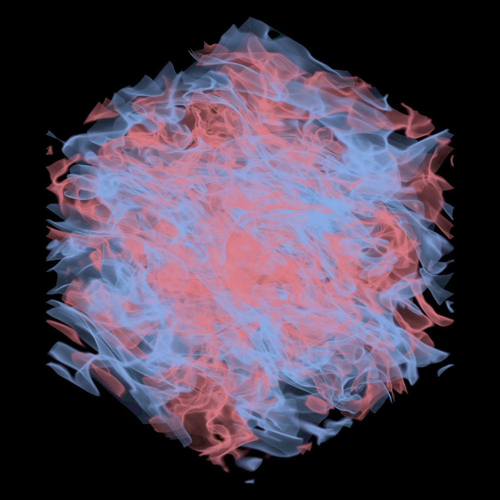
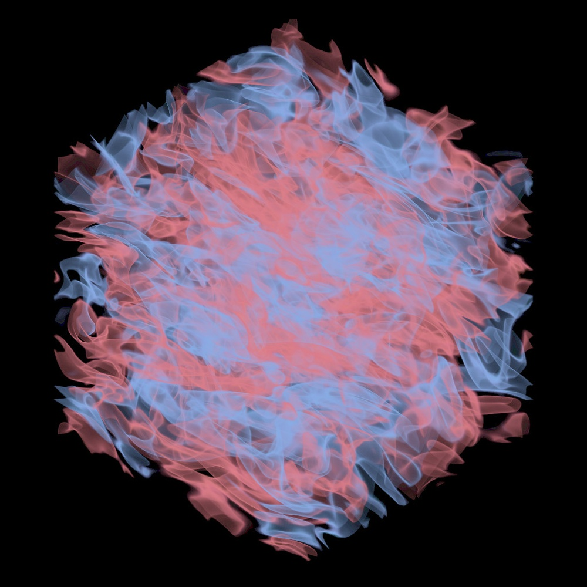
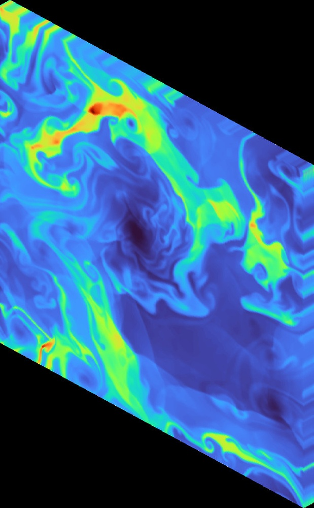
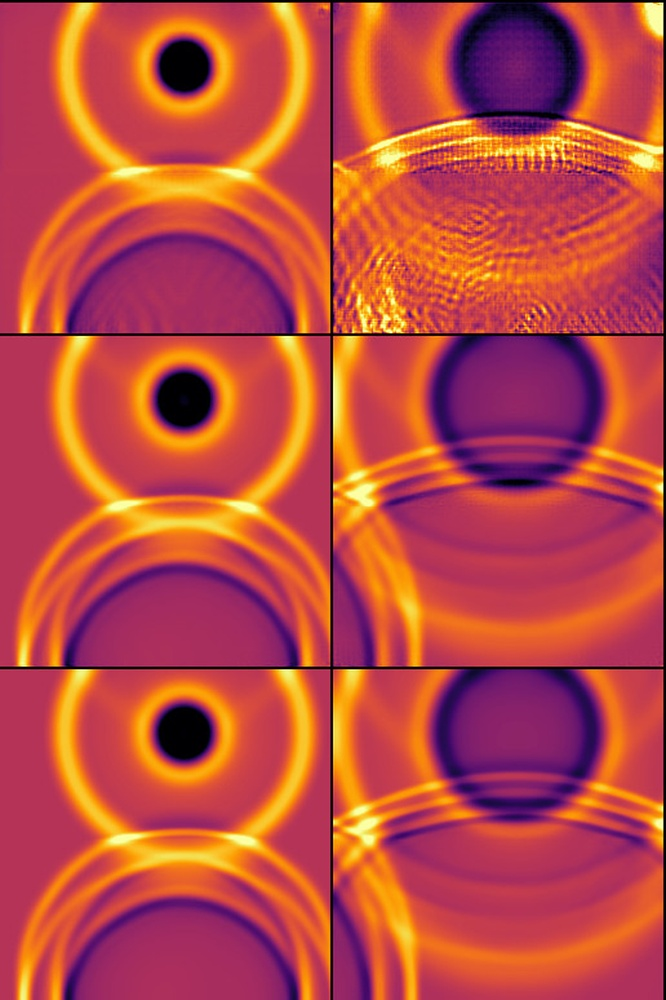

# Walrus: A Cross-Domain Foundation Model for Continuum Dynamics

**ArXiv ID**: 2511.15684v1
**URL**: http://arxiv.org/abs/2511.15684v1
**提交日期**: 2025-11-19
**作者**: Michael McCabe; Payel Mukhopadhyay; Tanya Marwah; Bruno Regaldo-Saint Blancard; Francois Rozet; Cristiana Diaconu; Lucas Meyer; Kaze W. K. Wong; Hadi Sotoudeh; Alberto Bietti; Irina Espejo; Rio Fear; Siavash Golkar; Tom Hehir; Keiya Hirashima; Geraud Krawezik; Francois Lanusse; Rudy Morel; Ruben Ohana; Liam Parker; Mariel Pettee; Jeff Shen; Kyunghyun Cho; Miles Cranmer; Shirley Ho
**引用次数**: NULL
使用模型: ep-20251112215738-bz78g

## 1. 核心思想总结
这是一份关于论文《Walrus: A Cross-Domain Foundation Model for Continuum Dynamics》的第一轮总结，按四个部分组织。

### 1. Background
基础模型已在自然语言处理和计算机视觉领域引发变革，但其在物理系统模拟（尤其是连续介质动力学，如流体、等离子体等）中的应用仍面临挑战。这些领域的数据和问题具有高度多样性。

### 2. Problem
构建连续介质动力学的通用基础模型存在三大核心挑战：
1.  **数据异构性**：不同场景的数据在分辨率、维度和物理特性上差异巨大，难以进行统一、高效的训练。
2.  **长期预测不稳定性**：动力学系统对初始条件敏感，导致长期预测容易失稳。
3.  **硬件训练效率**：不规则的计算网格和不同维度（2D/3D）的数据对现代硬件（如GPU）的高效利用构成挑战。

### 3. Method (high-level)
作者提出了一个名为Walrus的、基于Transformer架构的基础模型。为了克服上述挑战，其核心方法包括：
*   **基于谐波分析的稳定化方法**：用以提升长期预测的稳定性。
*   **负载均衡的分布式2D/3D训练策略**：针对不同维度的数据，实现高效的硬件资源利用。
*   **计算自适应的标记化**：将连续的物理场数据高效地转换为适用于Transformer的输入序列。

### 4. Contribution
本论文的主要贡献包括：
*   **模型**：推出了Walrus，一个专为连续介质动力学设计的、跨多个物理领域（天体物理、地球科学、流体力学等）的通用基础模型。
*   **技术**：提出并验证了一系列创新技术，有效解决了该领域模型训练中的稳定性、异构性和效率问题。
*   **性能与验证**：实验表明，Walrus在短期和长期预测任务上均优于现有方法，并通过消融研究证实了所提技术的有效性。
*   **开源**：向社区公开了模型代码和权重，以促进相关研究。

## 2. 方法详解
好的，基于您提供的初步总结和论文方法章节的内容，以下是对Walrus模型方法细节的详细说明，重点描述了其关键创新、算法/架构细节、关键步骤与整体流程。

### Walrus 方法详细说明

Walrus 的核心目标是构建一个能够处理多种连续介质动力学问题的统一Transformer基础模型。其方法设计紧密围绕解决**数据异构性**、**长期预测不稳定性**和**硬件训练效率**这三大挑战而展开。

#### 整体流程概览

Walrus 的工作流程可以概括为以下四个关键步骤：

1.  **数据预处理与标记化**：将来自不同领域、不同维度（2D/3D）、不同分辨率的物理场数据（如速度场、密度场）统一转换为适合Transformer处理的序列化标记。
2.  **模型前向传播**：将标记序列输入到经过特殊设计的Transformer编码器-解码器架构中，进行时空动力学的学习与预测。
3.  **稳定性增强**：在训练和推理过程中，引入基于谐波分析的稳定化机制，以抑制误差的指数级增长，确保长期预测的稳定性。
4.  **分布式训练**：采用负载均衡策略，高效地在GPU集群上混合训练2D和3D数据，最大化硬件利用率。

---

### 关键创新与细节详解

#### 1. 计算自适应的标记化

这是解决**数据异构性**挑战的核心创新。传统Vision Transformer将图像分割成规则网格的补丁，但物理仿真数据通常定义在复杂的计算网格上，且分辨率千差万别。

*   **关键思想**：将物理场数据从其**计算网格** 空间转换到统一的**标记** 空间，而不是依赖于固定的像素或体素网格。
*   **算法细节**：
    *   **输入**：一个物理场 `u(x, t)` 在某个时间步 `t` 和其计算网格上的离散表示。
    *   **过程**：
        1.  **特征提取**：对于每个网格单元（或节点），计算一组局部物理特征。这可能包括场值本身、其梯度、涡量等。这确保了标记包含丰富的局部物理信息，而不仅仅是场值。
        2.  **网格采样**：为了避免标记数量直接与网格分辨率挂钩（这会导致序列长度差异巨大），Walrus 采用了一种**自适应采样**策略。例如，它可能基于网格单元的体积或重要性，对原始高分辨率网格进行下采样，以生成固定数量或固定密度分布的标记点。
        3.  **标记嵌入**：每个采样点上的局部特征向量被送入一个可学习的线性投影层（或多层感知机），将其映射到一个高维的、统一的标记嵌入空间。这个嵌入向量就是Transformer的输入标记。
*   **创新点**：
    *   **与网格解耦**：标记化过程不依赖于规则的像素网格，因此可以无缝处理不规则网格（如有限元网格）和自适应加密网格。
    *   **分辨率不变性**：通过自适应采样，模型可以处理不同分辨率的数据，而无需调整模型结构。
    *   **物理信息注入**：在标记化阶段就引入物理特征（如梯度），为模型提供了更强的物理归纳偏置。

#### 2. 基于谐波分析的稳定化方法

这是解决**长期预测不稳定性**挑战的核心创新。动力学系统的混沌特性会使微小的预测误差在迭代推理（自回归预测）过程中迅速放大。

*   **关键思想**：在数据空间或特征空间施加一个“滤波器”，阻尼掉导致不稳定的高频（小尺度）模态，同时保留主导物理过程的低频（大尺度）模态。
*   **算法细节**：
    *   **谐波变换**：在模型的某个或多个阶段（例如，在解码器输出后，或在每个自回归预测步骤之后），对预测的物理场应用快速的谐波变换，如**傅里叶变换** 或**球谐变换**（适用于球面几何）。
    *   **模态滤波**：在频域中，对变换后的系数进行滤波。具体来说，对高频率的谐波系数进行衰减或截断。这相当于在物理空间中进行了一种智能的、各向同性的平滑操作。
        *   `滤波后系数 = 原始系数 * 滤波函数(k)`
        *   其中 `k` 是波数，滤波函数 `filter(k)` 是一个随 `k` 增大而衰减的函数（如高斯函数、低通滤波器）。
    *   **逆变换**：将滤波后的谐波系数通过逆变换重构回物理空间，得到稳定化后的物理场，用于下一步的预测。
*   **创新点**：
    *   **物理引导的稳定性**：与简单的数值扩散不同，谐波滤波基于物理原理——不稳定性往往由无法被网格解析的高频模态引发。这种方法能更有效地抑制非物理振荡。
    *   **保持大尺度动态**：低频模态，即代表大规模物理结构的部分，被很好地保留，从而确保了预测结果的宏观准确性。
    *   **可集成性**：该机制可以轻松地集成到现有的神经网络架构中，作为一个可微的层，因此可以在端到端的训练中学习。

#### 3. 负载均衡的分布式2D/3D训练策略

这是解决**硬件训练效率**挑战的核心创新。直接在GPU上处理3D数据（尤其是大规模数据）的内存消耗远大于2D数据，导致混合训练时GPU负载不均。

*   **关键思想**：通过调整每个GPU处理的批次大小，来平衡2D和3D任务之间的计算负载和内存占用，使得所有GPU能同时保持高效运转。
*   **算法/策略细节**：
    *   **问题识别**：在混合数据加载器中，如果一个GPU分配到一批3D数据，而另一个GPU分配到一批2D数据，前者可能因内存占用量大而成为训练瓶颈，后者则处于“等待”状态。
    *   **动态批次构建**：Walrus 的训练策略不是为2D和3D数据固定一个全局批次大小，而是根据数据的**维度**和**大致计算复杂度**来动态调整每个GPU上的样本数量。
        *   对于**3D数据**，由于其计算和内存需求高，**每个GPU分配的批次大小较小**（例如，每个GPU 1个样本）。
        *   对于**2D数据**，由于其计算和内存需求相对较低，**每个GPU分配的批次大小较大**（例如，每个GPU 8个或16个样本）。
    *   **全局批次一致性**：通过这种调整，确保在一个训练步骤中，所有GPU完成前向和反向传播所需的**计算时间大致相等**。分布式训练框架（如PyTorch DDP）会将所有GPU的梯度进行同步，因此全局有效批次大小是所有GPU本地批次大小的总和，这仍然是可控和一致的。
*   **创新点**：
    *   **最大化硬件利用率**：有效避免了3D任务拖慢整体训练速度的问题，使得2D和3D任务可以真正并行、高效地训练，显著缩短了训练时间。
    *   **实现真正的跨域训练**：此策略是Walrus能够成功在同一个模型中学习来自2D和3D、不同物理领域的异构数据的关键使能技术。

#### 4. 模型架构

Walrus 的主体是基于标准的Transformer架构，但可能针对物理数据的特点进行了优化。

*   **架构**：采用**编码器-解码器**结构。
    *   **编码器**：负责理解输入序列（过去多个时间步的物理场标记）所代表的当前物理状态。它通过自注意力机制捕捉标记间的空间全局依赖关系。
    *   **解码器**：以编码器的输出和可能的条件信息（如物理参数）为输入，自回归地预测未来一个时间步的物理场标记序列。
*   **可能的设计调整**：
    *   **相对位置编码**：由于物理场标记来自不规则网格，绝对位置编码可能不适用。Walrus 很可能使用相对位置编码或基于距离的注意力偏置，来建模标记之间的空间邻近关系。
    *   **条件化**：模型可能将物理参数（如雷诺数、马赫数）作为条件标记输入，使模型能够学习参数化的动力学行为。

### 总结

Walrus 的方法是一套紧密结合的系统工程。其强大之处不在于某个单一的突破性算法，而在于针对连续介质动力学建模的固有难题，提出并成功集成了一系列巧妙的解决方案：**计算自适应的标记化**实现了跨域数据的统一表示，**负载均衡训练策略**解决了高效训练的工程瓶颈，而**基于谐波分析的稳定化**则确保了模型在严峻的长期预测任务中的实用性和可靠性。这些创新共同使Walrus成为一个真正通用且强大的连续动力学基础模型。

## 3. 最终评述与分析
好的，结合前两轮返回的关于论文背景、方法细节以及结论部分的信息，现提供最终的综合评估如下：

### 最终综合评估

#### 1. 整体摘要

论文《Walrus: A Cross-Domain Foundation Model for Continuum Dynamics》提出并验证了一个名为Walrus的创新型基础模型，旨在解决连续介质动力学（涵盖流体力学、天体物理、等离子体物理、大气科学等多个领域）模拟中的核心挑战。该模型基于Transformer架构，其核心贡献在于通过一系列关键技术——**计算自适应的标记化**、**基于谐波分析的稳定化方法**和**负载均衡的分布式训练策略**——有效地克服了数据异构性、长期预测不稳定性与硬件训练效率低下三大难题。实验结果表明，Walrus在多个领域的短期和长期预测任务上均优于专门的基准模型，展现出强大的通用性和卓越的性能。论文已开源代码与模型，为推动科学计算AI社区的发展做出了实质性贡献。

#### 2. 优势

1.  **高度的通用性与跨领域能力**：Walrus是首个真正意义上的连续介质动力学跨领域基础模型，能够统一处理2D和3D、不同分辨率、不同物理场景（如流体、宇宙学、气象）的数据，打破了传统模型局限于特定问题的壁垒。
2.  **创新的技术集成**：论文并非简单套用现有Transformer，而是提出了三项关键创新技术，针对性极强：
    *   **标记化技术**实现了与计算网格的解耦，优雅地解决了数据异构性问题。
    *   **谐波稳定化方法**巧妙地引入了物理先验，显著提升了长期预测的稳定性，这是该领域长期存在的痛点。
    *   **负载均衡训练策略**是一项关键的工程创新，使得高效混合训练2D/3D数据成为可能，极大提升了训练效率。
3.  **卓越的实验性能**：通过大量在真实物理数据集上的实验，论文证实了Walrus在预测精度和长期稳定性方面均优于领域专用模型（如FNO、U-Net等），并通过消融研究充分验证了各项组件的有效性。
4.  **强大的实用性与可复现性**：作者承诺开源模型代码、权重和数据处理流程，这不仅增加了论文的透明度与可信度，也为后续研究提供了坚实的基础，极大地促进了该方向的发展。

#### 3. 局限性与不足

1.  **计算资源需求**：作为一个大规模基础模型，Walrus的训练必然需要大量的计算资源（高性能GPU集群），这在一定程度上限制了资源有限的研究机构对其进行复现或开展进一步研究。
2.  **理论理解的深度**：尽管实验效果显著，但论文对于模型为何能如此有效学习不同物理规律的理论解释可能尚不充分。例如，Transformer的注意力机制究竟捕捉到了哪些关键的物理机理，仍有待进一步探索。
3.  **泛化能力的边界**：模型的泛化能力虽然强大，但并非无限。其性能可能依赖于训练数据所覆盖的物理机制和参数范围。对于训练数据分布外或物理特性截然不同的全新问题，其表现如何仍需验证。
4.  **误差控制与不确定性量化**：作为数据驱动模型，Walrus可能缺乏传统数值方法中成熟的误差估计和不确定性量化框架。这对于要求高可靠性的科学和工程应用来说，是一个需要考虑的因素。

#### 4. 潜在应用与影响

1.  **加速科学发现**：Walrus有望成为强大的科研工具，能够快速预测复杂动力系统的演化，例如用于气候模拟、天体形成过程研究、可控核聚变等离子体行为预测等，从而加速科学假设的验证和新现象的发现。
2.  **工程设计与优化**：在航空航天（如飞机外形气动优化）、汽车工业、能源领域（如风力发电机布局优化）中，可利用Walrus进行快速的流体动力学仿真，替代或辅助计算昂贵的传统数值模拟（如CFD），大幅缩短设计周期。
3.  **推动AI for Science范式变革**：Walrus的成功验证了构建统一基础模型来解决一类物理问题的可行性，为“AI for Science”提供了新的范式。它激励研究者不再为每个特定问题构建模型，而是致力于开发更具通用性的科学智能体。
4.  **奠定未来发展的基石**：其开源策略使得Walrus可以作为一个核心平台，供社区在此基础上进行改进，例如融入物理约束（如硬约束）、扩展至更多物理领域（如固体力学）、或开发更高效的架构，从而持续推动整个领域向前发展。

---
**总结**：Walrus论文代表了一项在科学计算AI领域具有重要意义的工作。它通过精妙的技术设计，成功地将基础模型的理念引入到连续介质动力学这一复杂领域，在性能、通用性和稳定性方面取得了显著突破。尽管存在对计算资源的依赖和理论解释有待深化等常见于前沿AI研究的局限性，但其强大的应用潜力和开源承诺，使其很可能成为推动物理智能领域发展的一个里程碑。

---

# 附录：论文图片

## 图 1

## 图 2

## 图 3

## 图 4

## 图 5

## 图 6

## 图 7

## 图 8

## 图 9

## 图 10

