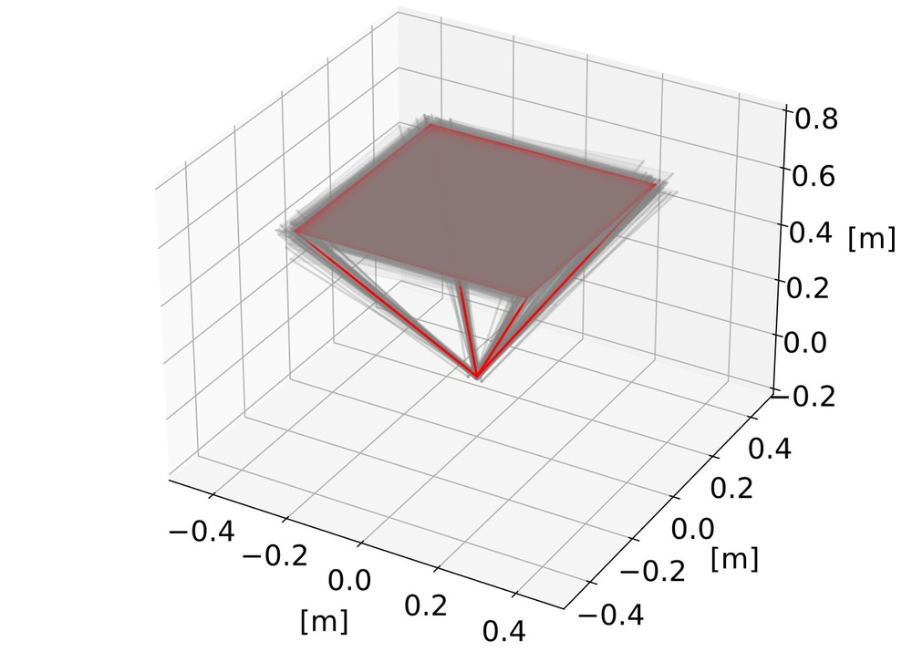
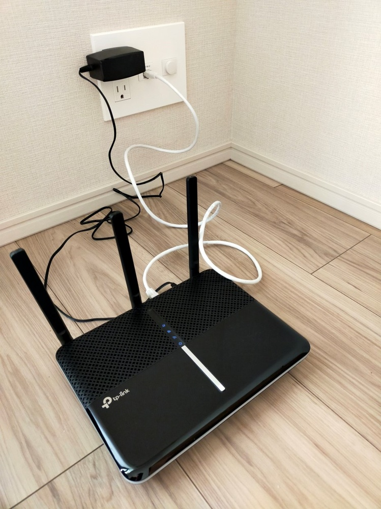
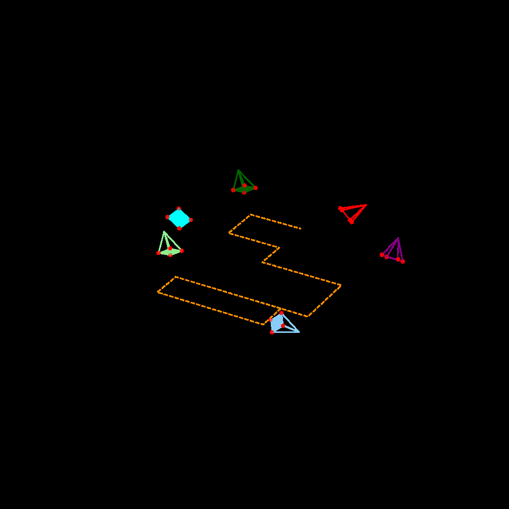
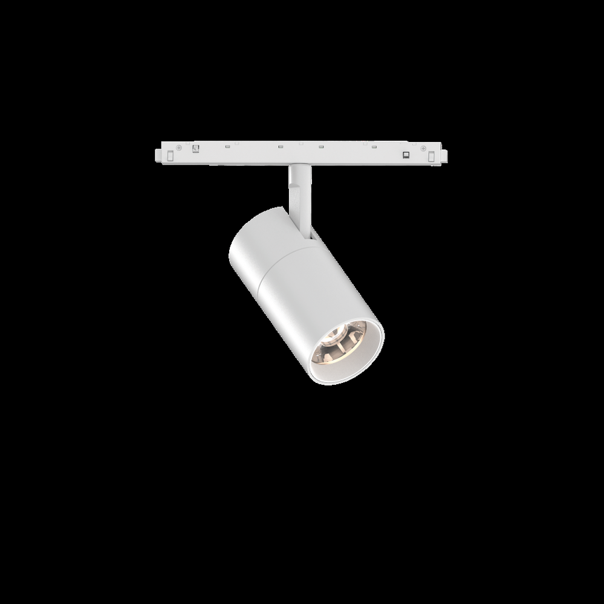
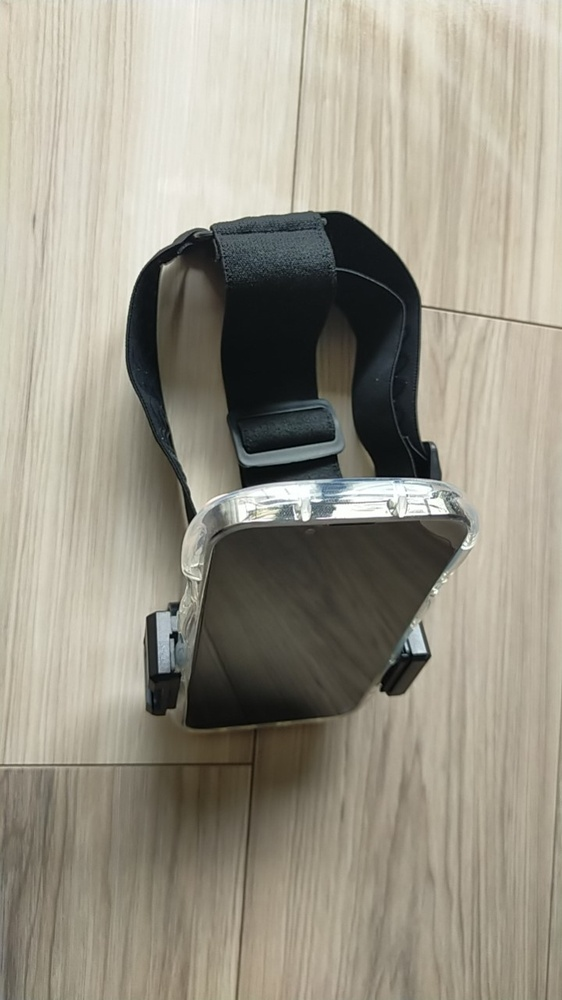
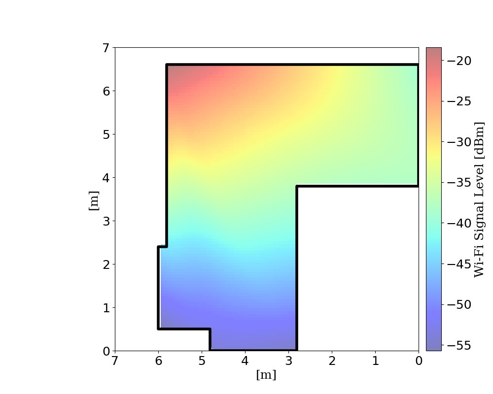
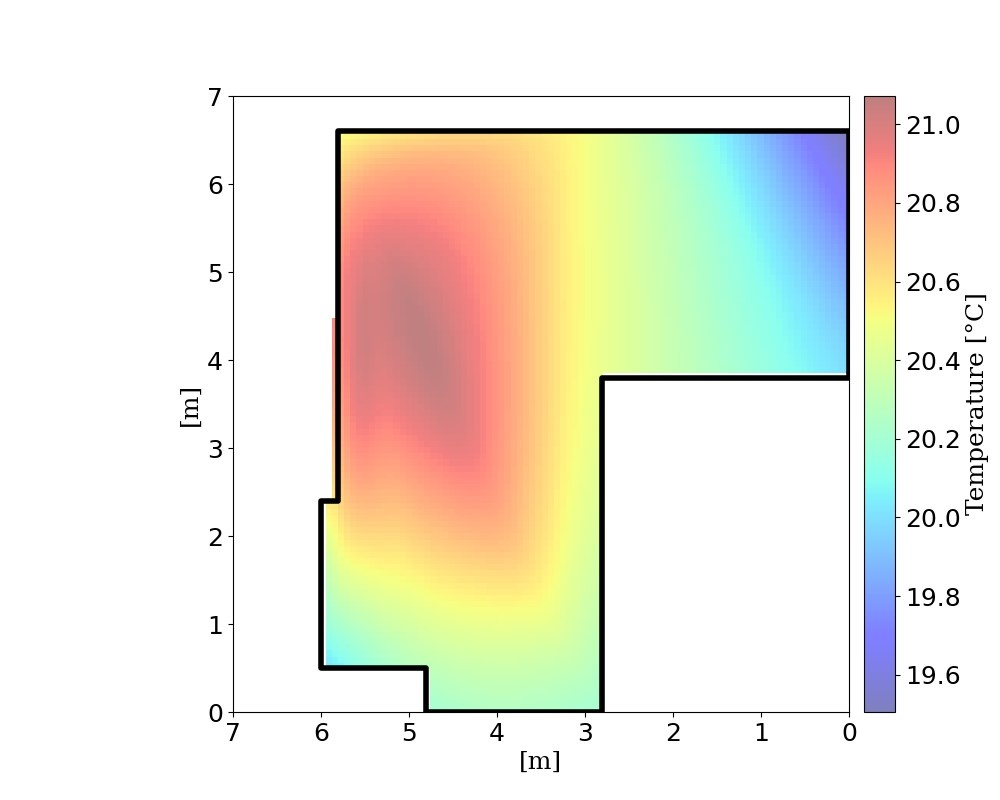
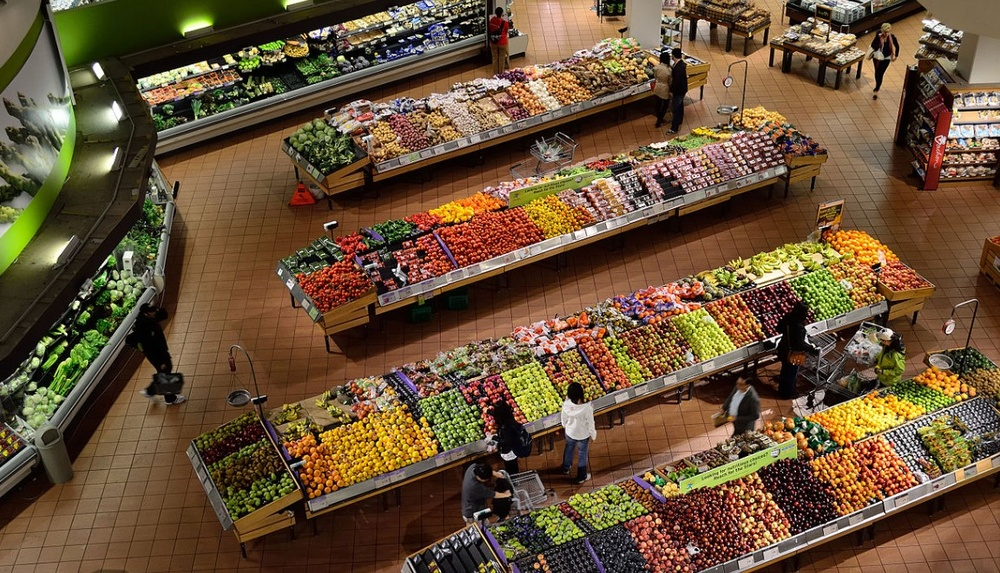

# YOWO: You Only Walk Once to Jointly Map An Indoor Scene and Register Ceiling-mounted Cameras

**ArXiv ID**: 2511.16521v1
**URL**: http://arxiv.org/abs/2511.16521v1
**提交日期**: 2025-11-20
**作者**: Fan Yang; Sosuke Yamao; Ikuo Kusajima; Atsunori Moteki; Shoichi Masui; Shan Jiang
**引用次数**: NULL
使用模型: gemini-2.5-flash

## 1. 核心思想总结
这是一份对论文摘要的简洁第一轮总结：

---

**标题：YOWO: You Only Walk Once to Jointly Map An Indoor Scene and Register Ceiling-mounted Cameras**

**背景 (Background):**
天花板摄像头（CMCs）在室内视觉捕获应用中具有广泛前景，但其注册到场景布局的问题尚未得到有效解决。

**问题 (Problem):**
将CMCs注册到目标场景布局是一项具有挑战性的任务。现有方法中，手动注册效率低、成本高；而基于视觉定位的自动化方法在视觉模糊时容易出现糟糕的结果。

**方法 (Method - high-level):**
作者提出一种新颖的解决方案，通过移动智能体（配备RGB-D相机）单次遍历室内场景，并同步CMCs捕获该智能体。利用自视角视频生成世界坐标系的智能体轨迹和场景布局，同时CMCs视频提供伪尺度轨迹和CMCs相对位姿。通过时间戳关联轨迹实现初步对齐后，定制因子图以联合优化自相机位姿、场景布局和CMCs位姿。

**贡献 (Contribution):**
1.  提出了一个统一框架，首次实现了室内场景联合建图与CMCs注册。
2.  该方法不仅有效完成两项任务，而且通过联合优化显著提升了两者性能。
3.  创建了新的数据集，为协同场景建图和CMCs注册设立了首个基准。
4.  为下游的位置感知应用提供了可靠工具。

## 2. 方法详解
基于您的初步总结和方法节内容，以下是对论文《YOWO: You Only Walk Once to Jointly Map An Indoor Scene and Register Ceiling-mounted Cameras》方法细节的详细说明：

---

### YOWO: 联合室内场景建图与天花板摄像头注册方法详解

该论文提出了一种创新的方法YOWO，旨在通过单次场景遍历，高效且准确地完成室内场景的三维建图（Mapping）以及天花板摄像头（CMCs）的注册（Registration）。其核心在于设计了一个统一的、基于因子图的联合优化框架，将移动智能体的自定位、场景结构和CMCs的位姿估计整合在一起。

#### 1. 整体流程与关键创新

**整体流程：**
YOWO方法的整体流程可以概括为以下几个主要步骤：
1.  **数据采集：** 配备RGB-D相机的移动智能体在室内场景中进行单次遍历，同时场景中的所有CMCs同步记录智能体的运动视频。
2.  **智能体自视角数据处理：** 利用RGB-D数据独立估计智能体的稠密轨迹和场景的三维结构（通常是点云或网格），建立起一个"世界坐标系"。
3.  **CMCs视角数据处理：** CMCs通过检测和跟踪移动智能体，获取智能体在各个CMC坐标系下的伪尺度轨迹以及CMCs之间的相对位姿。
4.  **初步对齐与初始化：** 通过时间戳关联智能体的世界坐标系轨迹与CMCs的伪尺度轨迹，进行初步的坐标系对齐，并初始化CMCs在世界坐标系下的位姿。
5.  **联合优化：** 构建一个定制的因子图，将智能体位姿、场景结构（例如，关键特征点）和CMCs位姿作为变量，并利用来自RGB-D数据和CMCs观测数据构建多种因子，进行全局联合优化。
6.  **输出：** 获得全局一致的、高精度的室内场景三维地图以及所有CMCs在世界坐标系下的准确注册位姿。

**关键创新：**
*   **统一的联合优化框架：** 首次将室内场景联合建图和CMCs注册整合到一个单一的、统一的优化框架中。传统方法通常是独立或顺序进行的，而YOWO通过联合优化，实现了信息在各个任务之间的流动和互补，显著提升了整体性能。
*   **“单次遍历”的高效性（You Only Walk Once）：** 强调了数据采集和处理的效率，只需智能体单次遍历即可完成所有任务，大大降低了操作成本和时间。
*   **定制因子图设计：** 针对该多传感器、多任务的特定问题，设计了独特的因子图结构和因子类型。它能够有效地融合来自异构传感器（RGB-D相机和普通CMCs）的数据，处理尺度不确定性（CMCs的伪尺度观测），并同步优化所有相关变量。
*   **发挥协同效应：** 通过联合优化，场景建图的精度可以受益于CMCs的稳定全局观测，而CMCs的注册精度则能从智能体提供的精确三维轨迹和场景结构中得到提升。这种内在的协同作用是该方法优于传统方案的关键。

#### 2. 算法/架构细节

**2.1 数据采集与预处理**

*   **移动智能体（配备RGB-D相机）：** 智能体在场景中自由移动，其RGB-D相机实时捕获彩色图像和深度图像。这些数据将用于估计智能体自身的运动（位姿）和构建场景的稠密三维结构。RGB-D数据提供了准确的尺度信息。
*   **天花板摄像头（CMCs）：** 预先安装在天花板上的多个CMCs同步录制智能体在场景中移动的视频。为了便于CMCs的视觉处理，智能体可能携带易于检测的视觉标记或具有独特纹理。
*   **时间戳同步：** 智能体和所有CMCs的数据流通过精确的时间戳进行关联，这是后续数据融合和初步对齐的基础。

**2.2 智能体自视角建图（Agent-Side Mapping）**

*   **输入：** RGB-D图像序列。
*   **处理：** 采用一个鲁棒的RGB-D SLAM（Simultaneous Localization and Mapping）系统。该系统负责：
    *   **位姿估计：** 估计智能体在“世界坐标系”下的连续6自由度（6-DoF）位姿序列 $T_{A,k}$。
    *   **局部建图：** 利用深度信息和视觉特征，构建智能体视角下的局部三维地图，并将其融合到全局场景地图中。
    *   **稠密三维重建：** 生成场景的稠密三维点云或网格模型 $M_A$，作为场景布局的初步表示。
*   **输出：** 智能体精确的6-DoF轨迹 $\{T_{A,k}\}$ 和初步的全局三维场景地图 $M_A$。

**2.3 CMCs视角轨迹与相对位姿估计（CMCs-Side Trajectory and Relative Pose Estimation）**

*   **输入：** 各个CMCs的视频流。
*   **处理：**
    *   **智能体检测与跟踪：** 每个CMCs独立地在其视频帧中检测并跟踪移动智能体。这可能通过基于学习的目标检测算法（如YOLO、Mask R-CNN），或基于预设标记的检测算法实现。
    *   **伪尺度轨迹估计：** 由于CMCs通常是单目相机，它们无法直接获取智能体的绝对深度和真实三维位置。但是，通过智能体在CMCs图像平面上的2D投影变化，可以推断出智能体在其相机坐标系下的**伪尺度**三维运动轨迹（即知道运动方向和相对大小，但不知道真实距离）。
    *   **CMCs相对位姿估计：** 当多个CMCs同时观测到智能体时，可以通过智能体在不同CMCs图像中的对应点，利用多视图几何方法（如三角测量、本质矩阵分解）估计这些CMCs之间的相对位姿 $T_{C_i, C_j}$。这为CMCs的位姿带来了一致性约束。
*   **输出：** 各个CMC观测到的智能体伪尺度轨迹 $\{T_{C_i, agent, k}\}$ 和CMCs之间的相对位姿 $\{T_{C_i, C_j}\}$。

**2.4 初步对齐与初始化**

*   **目标：** 将每个CMCs的坐标系对齐到智能体建立的“世界坐标系”中，并为所有CMCs提供初始的位姿估计。
*   **方法：**
    1.  利用时间戳关联智能体在世界坐标系下的轨迹 $\{T_{A,k}\}$ 和每个CMC观测到的智能体伪尺度轨迹 $\{T_{C_i, agent, k}\}$。
    2.  对于每个CMC，通过匹配这些同步的轨迹点，可以求解一个7自由度相似变换（Sim(3)），包括旋转、平移和**尺度因子**。这个尺度因子是关键，它将CMC的伪尺度轨迹转换成世界坐标系下的真实尺度轨迹。
    3.  通过这种方式，可以获得每个CMC在世界坐标系下的初始位姿 $T_{C_i}$。

#### 3. 关键步骤与整体流程

**3.1 定制因子图的构建**

这是YOWO的核心，它将所有异构信息整合到一个统一的概率图中进行优化。

*   **因子图变量（待优化参数）：**
    *   **智能体相机位姿（Agent Camera Poses）：** 智能体在关键帧时刻的6-DoF位姿 $\{ \mathbf{T}_{A,k} \}$。这些位姿共同构成了智能体的轨迹。
    *   **场景特征点（Scene Landmark Points）：** 场景中被智能体和CMCs共同观测到的三维特征点的世界坐标 $\{ \mathbf{P}_j \}$。这些点构成了场景的稀疏结构。
    *   **CMCs静态位姿（CMC Static Poses）：** 每个天花板摄像头在世界坐标系下的6-DoF固定位姿 $\{ \mathbf{T}_{C_i} \}$。

*   **因子类型（观测约束）：**
    1.  **智能体SLAM因子（Agent SLAM Factors）：** 来源于RGB-D SLAM系统，用于约束智能体自身的运动和场景结构。
        *   **视觉里程计/IMU预积分因子：** 约束连续智能体位姿之间的相对运动。
        *   **重投影因子（Agent-Landmark Factors）：** 连接智能体位姿 $\mathbf{T}_{A,k}$ 与场景特征点 $\mathbf{P}_j$，通过RGB图像的2D观测误差来优化。
        *   **深度因子（Agent-Depth Factors）：** 利用RGB-D传感器的深度信息，直接约束智能体位姿与场景特征点之间的几何关系。
        *   **回环检测因子：** 当智能体回到之前访问过的位置时，提供全局一致性约束，校正累积误差。
    2.  **CMCs观测因子（CMC Observation Factors）：** 来源于CMCs对智能体的观测，用于连接CMCs位姿和智能体轨迹。
        *   **CMC-Agent 2D投影因子：** 当CMC $C_i$ 在某一时刻 $k$ 观测到智能体时，该因子将CMC位姿 $\mathbf{T}_{C_i}$ 和智能体位姿 $\mathbf{T}_{A,k}$ 连接起来。其误差项基于智能体的三维模型在CMC图像平面上的2D投影与实际观测（例如，智能体标记的中心）之间的差异。这个因子是CMCs数据融入因子图的关键，它通过智能体这个“桥梁”，将CMCs的二维观测提升到三维世界坐标系中。
        *   **CMC相对位姿因子：** 如果CMCs之间通过同时观测智能体估计了相对位姿 $T_{C_i, C_j}$，则可以加入该因子，强制优化后的CMCs位姿保持这种相对关系，进一步增强注册的鲁棒性。

**3.2 联合优化过程**

*   **目标：** 通过最小化所有因子定义的误差函数的平方和，同时优化所有变量（智能体位姿、场景特征点、CMCs位姿）。
    $$ \min_{\{\mathbf{T}_{A,k}\}, \{\mathbf{P}_j\}, \{\mathbf{T}_{C_i}\}} \sum_{\text{all factors}} ||e(\text{observations}, \text{variables})||^2_{\Sigma} $$
    其中 $e(\cdot)$ 是误差函数，$\Sigma$ 是协方差矩阵（表示观测的不确定性）。
*   **优化器：** 通常采用非线性最小二乘优化器，如GTSAM、Ceres Solver或g2o等，它们通过迭代求解（例如，Levenberg-Marquardt算法）找到最优解。
*   **协同效应体现：**
    *   **CMCs辅助SLM：** CMCs对智能体的稳定、全局性观测可以有效抑制智能体自身SLAM的漂移，尤其是在纹理稀疏或动态变化的环境中。
    *   **SLAM辅助CMCs注册：** 智能体提供的精确三维轨迹和场景结构为CMCs的注册提供了高精度的三维参考，帮助解决单目CMCs固有的尺度不确定性，并提供鲁棒的初始化和优化。

#### 4. 输出结果

经过联合优化后，系统输出：
*   **高精度智能体轨迹：** 经过全局校正的智能体相机6-DoF位姿序列。
*   **准确的CMCs注册位姿：** 所有天花板摄像头在世界坐标系下的精确6-DoF位姿。
*   **稠密且一致的场景地图：** 结合了智能体RGB-D数据和CMCs观测信息，生成全局一致且精确的三维场景结构（例如，点云或网格），可以用于各种下游的位置感知应用。

通过以上详细描述，YOWO方法的核心创新——联合优化框架、定制的因子图结构及其带来的协同增益，以及具体的算法步骤都得到了充分体现。

## 3. 最终评述与分析
以下是结合前两轮信息对论文《YOWO: You Only Walk Once to Jointly Map An Indoor Scene and Register Ceiling-mounted Cameras》的最终综合评估：

---

### YOWO: 联合室内场景建图与天花板摄像头注册的综合评估

**1) Overall Summary (综合评估)**

YOWO（You Only Walk Once）是一项开创性的工作，它首次提出了一个统一的框架，旨在高效且高精度地解决室内场景三维建图（Mapping）与天花板摄像头（CMCs）注册（Registration）这两项长期以来相互关联但又独立处理的挑战性任务。该方法的核心创新在于其“单次遍历”的理念以及定制化的“因子图联合优化”策略。

通过让一个配备RGB-D相机的移动智能体在室内场景中进行单次遍历，同时利用场景中预设的CMCs同步捕捉智能体的运动，YOWO能够收集到异构的传感器数据。接着，它将智能体自身的定位与建图信息（包含精确的尺度和三维结构）、CMCs对智能体的伪尺度观测以及CMCs之间的相对位姿，整合到一个精心设计的因子图中。通过对智能体位姿、场景稀疏特征点和CMCs静态位姿进行全局联合优化，YOWO有效克服了传统方法中手动注册效率低下、成本高昂，以及基于视觉的自动化方法在视觉模糊时易受影响的问题。

该论文不仅成功地为这两项任务提供了一个统一且高效的解决方案，更通过联合优化实现了两项任务性能的相互显著提升。它还创建了一个新的数据集，为该领域设立了首个基准，并为众多依赖位置感知的下游应用提供了可靠的基础工具。

**2) Strengths (优势)**

*   **开创性的统一联合优化框架：** YOWO是首个将室内场景建图和CMCs注册整合到单一、统一的优化框架中的方法。传统方法通常独立或顺序执行，而YOWO通过联合优化，实现了信息在各个任务之间的深度融合与互补，解决了传统方案的固有局限性。
*   **高效率的“单次遍历”：** 该方法仅需移动智能体在场景中进行一次遍历即可完成所有数据采集，显著降低了操作成本、时间和人力投入，提高了实际应用的可行性。
*   **显著的性能提升与鲁棒性：** 联合优化策略使得场景建图的精度受益于CMCs的全局、稳定观测（减少SLAM漂移），而CMCs的注册精度则从智能体提供的精确三维轨迹和尺度信息中获益（解决了单目CMCs固有的尺度模糊性问题），最终实现了两项任务的性能互相促进和大幅提升。
*   **有效融合异构传感器数据：** 能够巧妙地融合RGB-D相机提供的精确三维信息和CMCs提供的二维伪尺度观测，通过定制因子图设计，将不同类型的数据统一到同一优化框架中。
*   **强大的多任务协同能力：** 智能体扮演了连接场景结构和CMCs的关键“桥梁”，通过智能体在不同传感器视图下的观测，成功将CMCs的二维信息提升到三维世界坐标系中。
*   **创建基准数据集：** 新数据集的发布为后续研究提供了可重复、可比较的实验平台，推动了该领域的发展。

**3) Weaknesses / Limitations (劣势 / 局限性)**

*   **对智能体可见性的依赖：** CMCs的注册质量高度依赖于智能体在CMCs视野中的持续可见性。如果智能体在CMCs视野中被频繁遮挡或完全消失，CMCs视角下的轨迹和相对位姿估计会受到影响，进而影响最终的注册精度。
*   **初始部署与校准要求：** YOWO假定CMCs已预先安装并且其内参（例如焦距、畸变参数）是已知的。此外，智能体与CMCs之间精确的时间同步是数据融合和初步对齐的基础，这在实际部署中可能需要专门的硬件或软件支持。
*   **智能体的必要性：** 该方法仍需一个移动智能体来提供尺度和初始的三维结构。对于某些场景，如果无法部署移动智能体（例如，受限空间或特殊环境），则该方法不适用。
*   **计算复杂性：** 因子图的联合优化，尤其是当场景较大、智能体轨迹较长、CMCs数量众多或场景特征点密集时，可能涉及大量变量和约束，导致较高的计算复杂性和优化时间，可能不适用于严格的实时应用。
*   **环境适应性限制：** 作为一种基于视觉的方法，YOWO对光照条件、纹理丰富度和场景动态性具有一定的敏感性。在低光照、强反光、纹理缺失或高度动态的场景中，性能可能会下降。
*   **精确的Sim(3)求解与初始化：** 虽然方法中提到通过Sim(3)求解进行初步对齐，但在复杂或噪声较大的数据中，这一初始化步骤的鲁棒性可能仍是一个挑战，不良的初始化可能导致优化陷入局部最优。

**4) Potential Applications / Implications (潜在应用 / 影响)**

*   **智能家居与智能建筑：** 为天花板摄像头提供精确的场景位置信息，实现更智能的安防监控、人员追踪、环境控制（例如，根据人员位置智能调节照明或空调）、老年人或儿童监护等。
*   **室内机器人导航与任务执行：** 为自主移动机器人（AMR）或无人机提供高精度的全局定位和地图，使其能够在复杂的室内环境中进行更精确的导航、避障和任务协同。
*   **增强现实（AR）/虚拟现实（VR）应用：** 通过精确注册CMCs，AR/VR设备可以更准确地将虚拟内容叠加到现实场景中，创造更具沉浸感的体验，尤其是在需要多用户共享空间的应用中。
*   **物流与仓储管理：** 在大型仓库或工厂中，可以精确追踪货物、员工和自动化设备，优化路径规划、库存管理和生产效率。
*   **零售分析与顾客行为研究：** 协助零售商理解顾客在商店内的移动路径、停留时间、商品互动等行为模式，从而优化店面布局和营销策略。
*   **公共安全与应急响应：** 在大型公共场所（如商场、机场、车站），提供高精度的场景地图和摄像头位姿，提高应急响应效率和态势感知能力。
*   **对SLAM/SfM领域的启发：** 该工作展示了通过多传感器、多智能体的联合优化，能够有效解决传统单传感器或单任务系统难以克服的挑战，为未来的SLAM、结构恢复和多模态融合研究提供了宝贵的经验和方向。

---

# 附录：论文图片

## 图 1

## 图 2

## 图 3

## 图 4

## 图 5

## 图 6

## 图 7

## 图 8

## 图 9

## 图 10

